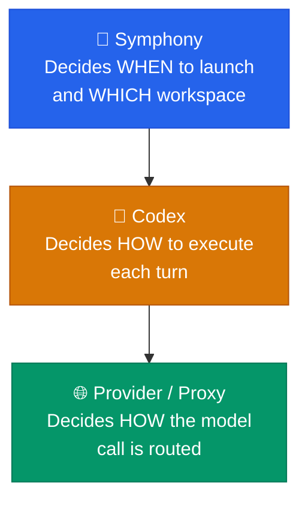

# 🔐 Trust and Auth

> Trust boundary and authentication model for Symphony Orchestrator.

---

## 🎵 Symphony's Role

Symphony has a narrow job: it launches a local Codex app-server, talks to Linear, manages issue workspaces, and reports state locally. It does **not** choose backing Codex accounts, perform browser login, or implement provider pooling itself.

---

## 🏗️ Trust Layers



| Layer | Component | Responsibility |
|:-----:|-----------|----------------|
| **1** | **Symphony** | Decides when to launch work and what workspace directory the worker can use |
| **2** | **Codex** | Decides how to execute each turn, including approvals and any configured MCP servers |
| **3** | **Provider / Proxy** | Decides which backing account or route handles the actual model call |

---

## ⚠️ Recommended v0.1 Trust Posture

> [!WARNING]
> The recommended v0.1 posture is deliberately **high trust** — appropriate **only** for local, operator-controlled environments:

| Setting | Value |
|---------|-------|
| `approval_policy` | `"never"` |
| `thread_sandbox` | `"danger-full-access"` |
| `turn_sandbox_policy` | `{ type: "dangerFullAccess" }` |

The workflow example uses an isolated `CODEX_HOME` so the daemon avoids inheriting personal experiments or unrelated MCP servers. The checked-in `WORKFLOW.md` points at the minimal fixture home in `tests/fixtures/codex-home-custom-provider` for the same reason.

---

## 🌐 Provider Boundary

Symphony launches the exact `codex.command` from `WORKFLOW.md`. If that Codex runtime is already configured to use a provider or proxy, Symphony inherits that behavior. This keeps account routing **below** Symphony instead of duplicating it inside.

---

## 🔑 Required Credentials

| Credential | Source | Purpose |
|------------|--------|---------|
| **Linear access** | `tracker.api_key` (typically `$LINEAR_API_KEY`) | Polling issues from Linear |
| **Codex auth** | Launched `codex app-server`'s `CODEX_HOME` | Authenticating model calls |

---

## 🚨 Required MCP Failure

> [!NOTE]
> This failure is a **Codex runtime startup problem**, not a Symphony orchestration bug:
> ```text
> error code=startup_failed msg="thread/start failed because a required MCP server did not initialize"
> ```
