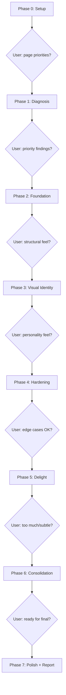

# v1.0 UI/UX Polish Orchestrator Prompt

## Overview

Build a self-contained prompt file that a user pastes into a fresh Opus 4.6 Claude Code session to orchestrate a comprehensive UI/UX production quality pass on the Risoluto dashboard. The prompt uses a subagent-per-skill architecture: the main session acts as a lean orchestrator dispatching 20 Impeccable design skills, each running in its own Agent subagent with fresh context, across 7 sequential phases.

The deliverable is a **prompt file** (markdown), not code changes. The prompt is the artifact.

## Problem Frame

Risoluto's functionality is production-ready but the dashboard UI needs a comprehensive quality pass before v1.0. The app has a copper-accent, zero-radius "stitch" design language documented in `.impeccable.md`, but the implementation has inconsistencies, rough edges, and missing polish across 15 unique pages (17 screenshottable views). The goal is a prompt that orchestrates the entire polish workflow end-to-end without exhausting the main session's context window. (see origin: `docs/brainstorms/2026-04-01-v1-ui-ux-polish-requirements.md`)

## Requirements Trace

- R1. Agent subagents for each design skill -- one skill per subagent, fresh context (see origin)
- R2. Lean orchestrator -- only tracks phase state, runs phase gate questions, dispatches subagents (see origin)
- R3. State persists to disk between subagents -- screenshots, summaries, change descriptions, verification results (see origin)
- R4. All 20 skills in 7-phase ordering: Diagnosis, Foundation, Visual Identity, Production Hardening, Delight, Consolidation, Polish (see origin)
- R5. Each subagent commits atomically (conventional commits) and runs verification before returning (see origin)
- R6. Verification: `pnpm run build && pnpm run lint && pnpm run format:check && pnpm test`. After CSS/view changes, also smoke tests (see origin)
- R7. Auto-fix with build-error-resolver subagent, escalate after 2 failed attempts (see origin)
- R8. Do not block pipeline on minor issues -- only escalate genuine build/test failures (see origin)
- R9. AskUserQuestion gates at every phase boundary (see origin)
- R10. Ask about page prioritization, aesthetic direction, UX copy tone, visual baseline updates (see origin)
- R11. Baseline screenshots of all 17 views in both dark and light themes (see origin)
- R12. After-screenshots of all views at the end (see origin)
- R13. Screenshots saved to `screenshots/baseline/` and `screenshots/after/` (see origin)
- R14. Never modify `design-system.css` or `tokens.css` token values without asking (see origin)
- R15. Never remove functionality (see origin)
- R16. Always preserve dark/light theme parity (see origin)
- R17. Always maintain WCAG AA contrast compliance (see origin)
- R18. If skill suggestions conflict with `.impeccable.md`, ask the user (see origin)

## Scope Boundaries

- The plan covers a **prompt file**, not code changes
- The prompt targets a fresh Opus 4.6 Claude Code session as the execution environment
- Aesthetic decisions are made by the user during execution via AskUserQuestion -- the prompt does not hardcode aesthetic choices
- Visual regression baselines are only updated with explicit user approval
- This plan does not design the individual skill behaviors -- those are pre-existing skills with their own SKILL.md definitions

## Context & Research

### Verified File Counts

All counts from the original prompt verified against the live codebase:

| Claimed | Actual | Path |
|---------|--------|------|
| 36 CSS files | 36 | `frontend/src/styles/` |
| 22 component modules | 22 | `frontend/src/components/` |
| 48 view modules | 48 | `frontend/src/views/` |
| 26 page modules | 26 | `frontend/src/pages/` |
| 23 UI modules | 23 | `frontend/src/ui/` |
| 119 smoke tests / 17 specs | 119 / 17 | `tests/e2e/specs/smoke/` |
| 7 visual baselines / 4 specs | 7 / 4 | `tests/e2e/specs/visual/` |

### Route Structure (20 registrations, 15 unique pages)

From `frontend/src/main.ts` lines 123-146:

| Route | Page | Notes |
|-------|------|-------|
| `/` | Overview | |
| `/queue` | Board (Kanban) | |
| `/queue/:id` | Board (filtered) | Same view as `/queue` |
| `/issues/:id` | Issue detail | Parameterized |
| `/issues/:id/runs` | Runs for issue | Sub-view |
| `/issues/:id/logs` | Logs for issue | Same view as `/logs/:id` |
| `/logs/:id` | Log viewer | Parameterized |
| `/attempts/:id` | Attempt detail | Parameterized |
| `/config` | Alias | Redirects to `/settings#devtools` |
| `/secrets` | Alias | Redirects to `/settings#credentials` |
| `/observability` | Observability | |
| `/settings` | Settings | |
| `/notifications` | Notifications | |
| `/git` | Git browser | |
| `/workspaces` | Workspace manager | |
| `/containers` | Container view | |
| `/templates` | Template editor | |
| `/audit` | Audit log | |
| `/welcome` | Redirect | Redirects to `/settings` |
| `/setup` | Setup wizard | |

The original prompt's "17 pages" for screenshots is correct when counting screenshottable views (includes parameterized sub-views like `/issues/{id}`, `/issues/{id}/runs`, `/logs/{id}`, `/attempts/{id}`, plus `/runs` list view which is a separate view from the issue-scoped runs).

**Correction needed:** The original prompt lists `/runs` as a standalone route, but there is no `/runs` route registration. Runs are only accessible via `/issues/:id/runs`. The screenshot list should be corrected to 16 screenshottable views (removing `/runs`).

### Design System Files (All Verified Present)

- `.impeccable.md` -- brand, color, typography, motion, component specs (10.6 KB)
- `frontend/src/styles/design-system.css` -- core design system (19.7 KB)
- `frontend/src/styles/tokens.css` -- design tokens (5.5 KB)
- `frontend/src/styles/polish-tokens.css` -- polish-specific tokens (1.7 KB)
- `frontend/src/styles/container-queries.css` -- responsive container queries (3.1 KB)

### Key UI Modules (All Verified Present)

- `frontend/src/ui/page-motion.ts` -- page transition system
- `frontend/src/ui/theme.ts` -- dark/light theme switching
- `frontend/src/ui/sidebar.ts` -- navigation sidebar
- `frontend/src/ui/shell.ts` -- app shell and outlet
- `frontend/src/ui/nav-items.ts` -- navigation items (4 groups: Operate, Configure, Observe, System)

### All 20 Skills Verified Present

Each skill has a `SKILL.md` at `~/.claude/skills/<name>/SKILL.md`:

| Phase | Skills |
|-------|--------|
| 1. Diagnosis | `/dogfood`, `/critique`, `/audit` |
| 2. Foundation | `/distill`, `/arrange`, `/typeset` |
| 3. Visual Identity | `/colorize`, `/bolder` OR `/quieter`, `/clarify` |
| 4. Production Hardening | `/harden`, `/adapt`, `/onboard` |
| 5. Delight | `/animate`, `/delight` |
| 6. Consolidation | `/normalize`, `/extract`, `/optimize` |
| 7. Polish | `/polish`, `/teach-impeccable` (conditional) |

Note: Phase 3 runs `/bolder` OR `/quieter` based on user choice, so 19-20 skills run total.

### Dev Server Setup

- Backend: `pnpm run dev -- --port 4000` (starts on port 4000)
- Frontend: Vite auto-starts on `http://localhost:5173`
- Both must be running for screenshots and `/dogfood`

## Key Technical Decisions

### D1: Subagent Dispatch Pattern -- Agent Tool with Skill Invocation

**Decision:** Each subagent is spawned via the `Agent` tool (formerly `Task`) with a prompt that instructs it to invoke a specific slash command skill and operate on specific files.

**Rationale:** The Agent tool creates a fresh context window for each subagent. The subagent receives a focused prompt describing: (1) which skill to invoke, (2) which files/pages to focus on, (3) what state to read from disk, (4) what state to write to disk, (5) verification commands to run. This keeps the orchestrator's context minimal -- it only sees the subagent's final summary, not all the skill's intermediate work.

**Pattern:**
```
Agent tool call:
  prompt: "You are a UI/UX subagent. Your task:
    1. Read state from .ui-polish/state/<previous-skill>-summary.md
    2. Read .impeccable.md for design context
    3. Run /<skill-name> against the running app at http://localhost:5173
    4. Commit changes atomically with conventional commit format
    5. Run verification: pnpm run build && pnpm run lint && pnpm run format:check && pnpm test
    6. Write summary to .ui-polish/state/<skill-name>-summary.md
    7. Return a 3-5 sentence summary of what changed"
```

### D2: State Artifacts on Disk -- `.ui-polish/state/` Directory

**Decision:** Each subagent writes a structured summary file to `.ui-polish/state/<skill-name>-summary.md` after completing its work. The directory also holds `phase-gate-decisions.md` for user decisions captured at phase boundaries.

**Rationale:** Subagents need downstream context but cannot share memory. Disk-based state is the only reliable handoff mechanism. Summaries should be short (under 200 lines) to fit in downstream subagent context alongside the skill itself.

**Artifacts per subagent:**
- `<skill-name>-summary.md` -- what changed, what was found, files modified, scores (for diagnosis skills)
- `<skill-name>-files.txt` -- list of files modified (for downstream awareness)

**Shared artifacts:**
- `phase-gate-decisions.md` -- accumulated user decisions from AskUserQuestion gates (appended by orchestrator)
- `baseline-manifest.md` -- list of baseline screenshot paths and descriptions
- `priority-list.md` -- user's page priorities and aesthetic direction (written after Phase 1 gate)

### D3: Dev Server Lifecycle -- Orchestrator Starts Once, Subagents Reuse

**Decision:** The orchestrator starts the dev server once in Phase 0 and keeps it running throughout. Subagents connect to the already-running server at `http://localhost:5173`.

**Rationale:** Starting/stopping the dev server per subagent wastes time and creates race conditions. The Vite dev server supports HMR, so subagents' file changes are reflected immediately. The orchestrator's prompt should instruct it to start the server in the background and verify it is responding before dispatching the first subagent.

**Server startup command:** `pnpm run dev -- --port 4000` (background process)
**Health check:** `curl -s http://localhost:5173 > /dev/null` with retry

### D4: Screenshot Strategy -- Baseline Once, Subagents Take Targeted Shots

**Decision:** The orchestrator's Phase 0 subagent takes comprehensive baseline screenshots of all 16 views in both themes (32 total images). Individual skill subagents take targeted screenshots of pages they modify (for their own verification and summary). The orchestrator's Phase 7 subagent takes comprehensive after-screenshots.

**Rationale:** Having every subagent re-screenshot all 16 pages would waste time and context. Diagnosis skills (`/dogfood`, `/critique`, `/audit`) need the baselines -- they read from `screenshots/baseline/`. Other skills only screenshot pages they touch.

**Screenshot tool:** `agent-browser` (snapshot + screenshot commands)

### D5: Commit Strategy -- Each Subagent Commits Individually

**Decision:** Each subagent commits its own changes with conventional commit format before returning control to the orchestrator.

**Rationale:** Individual commits per skill provide clean git history, easy rollback per skill, and clear attribution. The commit message includes the skill name: `feat(ui): /arrange -- fix grid spacing across all pages`. If a skill's verification fails and the build-error-resolver fixes it, that gets a separate `fix(ui):` commit.

### D6: Error Recovery Flow -- Subagent-Based Auto-Fix with Escalation

**Decision:** When a skill subagent's verification fails, the orchestrator spawns a `build-error-resolver` subagent with the error output. If the fix subagent fails twice, the orchestrator escalates to the user via AskUserQuestion.

**Flow:**
1. Skill subagent runs verification, reports failure
2. Orchestrator spawns build-error-resolver subagent with: error output, list of files changed by the skill, instruction to fix
3. Resolver commits fix, runs verification
4. If still failing, orchestrator spawns resolver again (attempt 2)
5. If still failing, orchestrator asks user: "Build is failing after /arrange. Error: [X]. Options: (a) I'll fix it manually, (b) skip this skill and continue, (c) revert this skill's changes"

### D7: Phase Gate Questions -- Orchestrator Handles Directly

**Decision:** AskUserQuestion calls happen in the orchestrator, not in subagents. After each phase's subagents complete, the orchestrator presents a summary (assembled from state files) and asks the user for direction.

**Rationale:** Subagents should focus on execution. The orchestrator is the user-facing controller. Phase gate questions are the orchestrator's primary responsibility beyond dispatch.

## Open Questions

### Resolved During Planning

- **Q: What state artifacts should each subagent write to disk?** (Deferred from requirements)
  Resolution: Each subagent writes `<skill-name>-summary.md` and `<skill-name>-files.txt` to `.ui-polish/state/`. Shared files: `phase-gate-decisions.md`, `baseline-manifest.md`, `priority-list.md`. See D2.

- **Q: Should the orchestrator start the dev server once or each subagent manage its own?** (Deferred from requirements)
  Resolution: Orchestrator starts once in Phase 0, subagents reuse. See D3.

- **Q: How should subagents access screenshots?** (Deferred from requirements)
  Resolution: Baselines taken once in Phase 0, saved to `screenshots/baseline/`. Skill subagents read from there and take targeted shots of pages they modify. After-screenshots taken in Phase 7. See D4.

- **Q: Should each subagent commit individually or batch per phase?** (Deferred from requirements)
  Resolution: Each subagent commits individually for clean history and easy rollback. See D5.

- **Q: How many screenshottable views are there?** (Discovered during research)
  Resolution: 16 views, not 17. The original prompt listed `/runs` as a standalone route, but it does not exist -- runs are only accessible via `/issues/:id/runs`. The prompt should list 16 views.

### Deferred to Implementation

- **Exact agent-browser commands for full-page screenshots** -- Depends on the tool's current API; the prompt author will use `agent-browser snapshot` and `agent-browser screenshot` as appropriate.
- **Maximum summary file size per subagent** -- Start with 200-line guidance, adjust during prompt testing if downstream subagents run out of context.
- **Whether `/teach-impeccable` runs at all** -- Conditional on whether `.impeccable.md` is found missing or outdated. The prompt should include it as a conditional Phase 0 step.

## High-Level Technical Design

> *Directional guidance for review, not implementation specification.*

### Orchestrator Control Flow



### Subagent Dispatch Sequence (Per Skill)

```
Orchestrator                          Subagent (Agent tool)
    |                                       |
    |-- spawn with prompt ----------------->|
    |                                       |-- read .ui-polish/state/*
    |                                       |-- read .impeccable.md
    |                                       |-- invoke /<skill>
    |                                       |-- commit changes
    |                                       |-- run verification
    |                                       |   |
    |                                       |   |-- [PASS] write summary
    |                                       |   |-- [FAIL] return error
    |                                       |<--|
    |<-- summary or error ------------------|
    |
    |-- [if error] spawn build-error-resolver
    |-- [if 2 fails] AskUserQuestion
    |-- [if pass] continue to next skill
```

### State Directory Layout

```
.ui-polish/
  state/
    baseline-manifest.md        # Phase 0: list of baseline screenshots
    phase-gate-decisions.md     # Accumulated user decisions
    priority-list.md            # User priorities after Phase 1
    dogfood-summary.md          # Skill output summaries
    dogfood-files.txt
    critique-summary.md
    critique-files.txt
    audit-summary.md
    audit-files.txt
    ... (one pair per skill)
screenshots/
  baseline/
    overview-dark.png
    overview-light.png
    queue-dark.png
    ... (32 total: 16 views x 2 themes)
  after/
    overview-dark.png
    ... (same structure)
```

## Implementation Units

Each unit below describes a **section of the prompt file** to write, not code to implement.

- [ ] **Unit 1: Prompt Header and Critical Instructions**

  **Goal:** Write the opening section of the prompt that establishes identity, constraints, and the subagent architecture contract.

  **Requirements:** R1, R2, R14, R15, R16, R17, R18

  **Dependencies:** None

  **Files:**
  - Create: `.anvil/v1-ui-ux-polish/prompt.md`

  **Approach:**
  - Open with role statement: "You are a lean orchestrator for a UI/UX production quality pass..."
  - Define the subagent contract: one Agent tool call per skill, fresh context, disk-based state handoff
  - List all hard constraints (never modify token values, never remove functionality, always preserve theme parity, WCAG AA, etc.)
  - Define conventional commit format for subagents
  - Define verification command strings (build/lint/format/test, smoke tests)
  - Include the error recovery protocol (build-error-resolver, 2-attempt escalation)
  - Include the `.ui-polish/state/` directory convention

  **Patterns to follow:**
  - The original prompt's "Critical Instructions" section structure (clear numbered rules)
  - The original prompt's "Rules" section at the bottom

  **Test scenarios:**
  - Happy path: reader understands the orchestrator's role in 30 seconds
  - Edge case: instructions must be unambiguous enough that Opus 4.6 never tries to run a skill inline (without Agent tool)
  - Error path: error recovery flow must be clear enough that the orchestrator knows exactly when to spawn build-error-resolver vs escalate

  **Verification:**
  - A reader can identify: what the orchestrator does, what subagents do, how state flows, how errors are handled

- [ ] **Unit 2: Technical Context and Codebase Reference**

  **Goal:** Write the section that gives the orchestrator (and subagents) accurate codebase context: file counts, paths, routes, design system files, dev server setup.

  **Requirements:** R11, R13

  **Dependencies:** Unit 1

  **Files:**
  - Modify: `.anvil/v1-ui-ux-polish/prompt.md`

  **Approach:**
  - Include verified file counts table (36 CSS, 22 components, 48 views, 26 pages, 23 UI modules)
  - Include corrected route table (20 registrations, 15 unique pages, 16 screenshottable views)
  - List design system file paths with sizes
  - List key UI module paths
  - Define dev server setup: `pnpm run dev -- --port 4000`, frontend on `http://localhost:5173`
  - Define the 16 screenshottable views with their routes and descriptive screenshot filenames

  **Patterns to follow:**
  - The original prompt's "Technical Context" section

  **Test scenarios:**
  - Happy path: subagent receives accurate file paths and counts
  - Edge case: corrected view count (16, not 17 -- no standalone `/runs` route)

  **Verification:**
  - Every file path in the prompt is verified to exist in the codebase
  - Route list matches `frontend/src/main.ts` registrations

- [ ] **Unit 3: Subagent Prompt Template**

  **Goal:** Write the reusable template that the orchestrator uses to construct each Agent tool call's prompt string. This is the contract between orchestrator and subagent.

  **Requirements:** R1, R2, R3, R5, R6

  **Dependencies:** Unit 1, Unit 2

  **Files:**
  - Modify: `.anvil/v1-ui-ux-polish/prompt.md`

  **Approach:**
  - Define the template with placeholders: `{skill_name}`, `{phase_name}`, `{prior_summaries}`, `{focus_pages}`, `{user_decisions}`, `{verification_commands}`
  - Template sections: (1) role and task, (2) context files to read, (3) state files to read, (4) skill invocation, (5) commit instructions, (6) verification, (7) output summary format, (8) state files to write
  - Define the summary output format: what changed, files modified, scores (for diagnosis), issues found, screenshots taken
  - Specify that subagents must not modify `.impeccable.md`, `design-system.css`, or `tokens.css` without the orchestrator's explicit instruction

  **Patterns to follow:**
  - The Agent tool's prompt parameter pattern from Claude Code

  **Test scenarios:**
  - Happy path: template produces a prompt that a subagent can execute end-to-end
  - Edge case: template must work for both diagnosis skills (which produce reports) and execution skills (which modify files)
  - Error path: template must instruct subagent to return structured error info on verification failure

  **Verification:**
  - Template covers all 7 subagent responsibilities: read state, read context, run skill, commit, verify, write state, return summary

- [ ] **Unit 4: Phase 0 -- Setup and Baseline**

  **Goal:** Write the Phase 0 section covering dev server startup, `.impeccable.md` verification, baseline screenshots, and initial state directory creation.

  **Requirements:** R11, R13

  **Dependencies:** Unit 3

  **Files:**
  - Modify: `.anvil/v1-ui-ux-polish/prompt.md`

  **Approach:**
  - Orchestrator creates `.ui-polish/state/` and `screenshots/baseline/` and `screenshots/after/` directories
  - Orchestrator starts dev server in background: `pnpm run dev -- --port 4000`
  - Orchestrator verifies `.impeccable.md` exists; if not, conditional `/teach-impeccable` subagent
  - Orchestrator reads `.impeccable.md` and `design-system.css` and `tokens.css` for its own context
  - Orchestrator spawns a "baseline-screenshot" subagent that uses `agent-browser` to capture all 16 views x 2 themes = 32 screenshots
  - Subagent writes `baseline-manifest.md` listing all screenshot paths
  - Phase 0 gate: AskUserQuestion with baseline summary, ask about page priorities, skip/deprioritize decisions

  **Patterns to follow:**
  - The original prompt's Phase 0 structure

  **Test scenarios:**
  - Happy path: dev server starts, screenshots captured, user provides priorities
  - Edge case: `.impeccable.md` missing -- trigger `/teach-impeccable`
  - Error path: dev server fails to start -- clear error message, do not proceed

  **Verification:**
  - 32 screenshots exist in `screenshots/baseline/`
  - `baseline-manifest.md` and `priority-list.md` exist in `.ui-polish/state/`

- [ ] **Unit 5: Phase 1 -- Diagnosis (dogfood, critique, audit)**

  **Goal:** Write the Phase 1 section dispatching three diagnosis subagents and the phase gate question.

  **Requirements:** R4, R9, R10

  **Dependencies:** Unit 3, Unit 4

  **Files:**
  - Modify: `.anvil/v1-ui-ux-polish/prompt.md`

  **Approach:**
  - Three sequential subagents: `/dogfood`, `/critique`, `/audit`
  - `/dogfood` subagent: browse the running app, find bugs and UX issues, produce a report with screenshots
  - `/critique` subagent: evaluate design from UX perspective using baseline screenshots, score visual hierarchy / information architecture / emotional resonance / cognitive load / quality / AI slop detection
  - `/audit` subagent: check accessibility (WCAG AA), performance, theming consistency, responsive design, anti-patterns
  - Each writes its summary to `.ui-polish/state/`
  - Diagnosis skills do NOT modify files -- they produce reports only. No commits needed.
  - Phase 1 gate: orchestrator reads all three summaries, presents structured findings (P0-P3 severity), asks user for priorities, aesthetic direction (bolder vs quieter), specific pain points

  **Patterns to follow:**
  - The original prompt's Phase 1 structure
  - Diagnosis skills are read-only -- no verification needed

  **Test scenarios:**
  - Happy path: three reports produced, user provides direction
  - Edge case: `/dogfood` needs the running app -- ensure dev server is confirmed running before dispatch
  - Error path: if agent-browser fails to connect, subagent should report the error clearly

  **Verification:**
  - Three summary files exist in `.ui-polish/state/`
  - `priority-list.md` written with user's prioritization

- [ ] **Unit 6: Phase 2 -- Foundation (distill, arrange, typeset)**

  **Goal:** Write the Phase 2 section dispatching three structural improvement subagents.

  **Requirements:** R4, R5, R6, R9

  **Dependencies:** Unit 3, Unit 5

  **Files:**
  - Modify: `.anvil/v1-ui-ux-polish/prompt.md`

  **Approach:**
  - Three sequential subagents: `/distill`, `/arrange`, `/typeset`
  - Each receives: diagnosis summaries, user priorities, design system context
  - `/distill`: strip unnecessary complexity from pages with too many competing elements. Ask user (via return summary) before removing anything structural
  - `/arrange`: fix layout, spacing, visual rhythm. Align to 8px grid tokens. Reference `tokens.css` spacing values
  - `/typeset`: refine typography. Verify Space Grotesk / Manrope / IBM Plex Mono choices. Fix hierarchy inconsistencies
  - Each commits atomically, runs verification (including smoke tests after CSS/view changes)
  - Phase 2 gate: orchestrator presents before/after screenshots of changed pages, asks "does this feel right?"

  **Patterns to follow:**
  - The original prompt's Phase 2 structure

  **Test scenarios:**
  - Happy path: three skills improve structure, build stays green
  - Edge case: `/distill` wants to remove a page element -- subagent must flag this in summary for user confirmation at gate
  - Error path: verification fails after `/arrange` -- trigger build-error-resolver flow

  **Verification:**
  - Three pairs of summary + files-list in `.ui-polish/state/`
  - Build and smoke tests pass after each subagent

- [ ] **Unit 7: Phase 3 -- Visual Identity (colorize, bolder/quieter, clarify)**

  **Goal:** Write the Phase 3 section dispatching color, intensity, and copy improvement subagents.

  **Requirements:** R4, R5, R6, R9, R10

  **Dependencies:** Unit 3, Unit 6

  **Files:**
  - Modify: `.anvil/v1-ui-ux-polish/prompt.md`

  **Approach:**
  - `/colorize` subagent: evaluate and improve color usage. Copper accent effectiveness, status color clarity, warm/intentional palette, dark/light balance
  - Intensity direction: orchestrator asks user "bolder or quieter?" via AskUserQuestion BEFORE dispatching. Then dispatches `/bolder` OR `/quieter` based on answer
  - `/clarify` subagent: improve all UX copy. Empty states, errors, buttons, headings, setup wizard, tooltips. Orchestrator asks about tone (technical vs friendly) before dispatch
  - Phase 3 gate: orchestrator presents visual identity changes, asks "how does the personality feel?"

  **Patterns to follow:**
  - The original prompt's Phase 3 structure
  - Note the mid-phase AskUserQuestion for bolder/quieter -- this is unique to Phase 3

  **Test scenarios:**
  - Happy path: three skills refine visual identity, user approves direction
  - Edge case: user says "neither bolder nor quieter, current intensity is right" -- orchestrator skips the intensity skill entirely
  - Error path: `/colorize` modifies a token value in `design-system.css` -- subagent should know this is forbidden per R14

  **Verification:**
  - Three summary files in `.ui-polish/state/` (or two if intensity skill is skipped)
  - User's intensity and tone decisions recorded in `phase-gate-decisions.md`

- [ ] **Unit 8: Phase 4 -- Production Hardening (harden, adapt, onboard)**

  **Goal:** Write the Phase 4 section dispatching resilience, responsive, and onboarding subagents.

  **Requirements:** R4, R5, R6, R9

  **Dependencies:** Unit 3, Unit 7

  **Files:**
  - Modify: `.anvil/v1-ui-ux-polish/prompt.md`

  **Approach:**
  - `/harden` subagent: text overflow, error states, edge cases (long titles, empty data, 100+ items), loading states, graceful degradation
  - `/adapt` subagent: responsive design. Mobile (320-768px), tablet (768-1024px), large desktop (1440px+). Container queries from `container-queries.css`. Touch targets
  - `/onboard` subagent: first-run experience. Setup wizard flow (`/setup`), empty states on every page, getting-started on overview, progressive disclosure
  - Phase 4 gate: orchestrator shows error states, mobile views, empty states, asks "anything missing?"

  **Patterns to follow:**
  - The original prompt's Phase 4 structure

  **Test scenarios:**
  - Happy path: three skills harden the UI for production edge cases
  - Edge case: `/adapt` needs to test at multiple viewport widths -- subagent should use agent-browser's resize capability
  - Error path: `/harden` adds error handling that breaks existing tests -- build-error-resolver fixes

  **Verification:**
  - Three summary files with specific edge cases addressed
  - Smoke tests still pass at standard viewport

- [ ] **Unit 9: Phase 5 -- Delight (animate, delight)**

  **Goal:** Write the Phase 5 section dispatching animation and personality subagents.

  **Requirements:** R4, R5, R6, R9

  **Dependencies:** Unit 3, Unit 8

  **Files:**
  - Modify: `.anvil/v1-ui-ux-polish/prompt.md`

  **Approach:**
  - `/animate` subagent: purposeful micro-interactions. Page transitions (enhance `page-motion.ts`), hover/focus states, status change animations, loading transitions, metric counters. Must respect `prefers-reduced-motion`. Must use existing motion tokens: `--motion-instant` (120ms), `--motion-fast` (180ms), `--motion-medium` (260ms), `--motion-slow` (420ms), `--ease-out-quart`, `--ease-out-quint`, `--ease-out-expo`
  - `/delight` subagent: personality touches. Success states, empty states with character, satisfying interactions. Must follow `.impeccable.md` rule: "Never decorative animation. Motion should reflect real state."
  - Phase 5 gate: orchestrator describes animations, asks "too much? too subtle?"

  **Patterns to follow:**
  - The original prompt's Phase 5 structure
  - Motion token values from `.impeccable.md`

  **Test scenarios:**
  - Happy path: animations add polish without impacting performance
  - Edge case: `/animate` must verify GPU-accelerated transforms only (no layout-triggering animations)
  - Error path: animation breaks a smoke test's timing expectation -- build-error-resolver adjusts

  **Verification:**
  - Two summary files describing specific animations added
  - `prefers-reduced-motion` handling verified

- [ ] **Unit 10: Phase 6 -- Consolidation (normalize, extract, optimize)**

  **Goal:** Write the Phase 6 section dispatching design system alignment, component extraction, and performance optimization subagents.

  **Requirements:** R4, R5, R6, R9

  **Dependencies:** Unit 3, Unit 9

  **Files:**
  - Modify: `.anvil/v1-ui-ux-polish/prompt.md`

  **Approach:**
  - `/normalize` subagent: realign all changes to design tokens. No magic numbers. Typography scale compliance. Spacing scale compliance. Color token usage (no raw hex outside `design-system.css`/`tokens.css`). Component pattern consistency
  - `/extract` subagent: consolidate reusable patterns that emerged during enhancement. New component patterns, tokens to formalize, CSS to DRY up across the 36 CSS files
  - `/optimize` subagent: performance pass. CSS bundle analysis, font loading strategy, animation performance (GPU transforms only), SSE/polling UI efficiency, perceived performance
  - Phase 6 gate: "design system is tight, performance optimized, ready for final polish?"

  **Patterns to follow:**
  - The original prompt's Phase 6 structure

  **Test scenarios:**
  - Happy path: all changes use tokens, CSS is consolidated, performance improved
  - Edge case: `/extract` creates new shared components -- must ensure no circular imports
  - Error path: `/optimize` merges CSS files that break import order -- build-error-resolver handles

  **Verification:**
  - Three summary files listing specific normalizations, extractions, optimizations
  - No raw hex values outside token files (verifiable by grep)

- [ ] **Unit 11: Phase 7 -- Final Polish, Screenshots, and Report**

  **Goal:** Write the Phase 7 section dispatching the final polish skill, after-screenshots, visual diff, test suite, and final report.

  **Requirements:** R4, R5, R6, R9, R12, R13

  **Dependencies:** Unit 3, Unit 10

  **Files:**
  - Modify: `.anvil/v1-ui-ux-polish/prompt.md`

  **Approach:**
  - `/polish` subagent: pixel-level alignment, spacing consistency, typography micro-adjustments, color/contrast final check, interaction state completeness (hover, focus, active, disabled), icon consistency, form field consistency, edge case presentation
  - After-screenshot subagent: same 16 views x 2 themes = 32 screenshots to `screenshots/after/`
  - Orchestrator: present before/after comparison for each view
  - Orchestrator: run full verification suite including smoke tests
  - Orchestrator: if visual baselines need updating, AskUserQuestion before `--update-snapshots`
  - Final report via AskUserQuestion: critique score improvement (Phase 1 vs now), audit score improvement, list of all changes by page, remaining items, "ready to ship v1.0?"

  **Patterns to follow:**
  - The original prompt's Phase 7 structure

  **Test scenarios:**
  - Happy path: polish completes, before/after comparison shows clear improvement, all tests pass
  - Edge case: visual regression baselines have drifted -- orchestrator must ask before updating
  - Error path: final test suite reveals a regression from earlier phase -- orchestrator presents options

  **Verification:**
  - 32 after-screenshots exist in `screenshots/after/`
  - Full build + lint + format + test + smoke pass
  - User receives final report with before/after comparison

- [ ] **Unit 12: Assembly and Prompt File Quality Pass**

  **Goal:** Assemble all sections into a single coherent prompt file and do a quality pass for clarity, completeness, and correct file paths.

  **Requirements:** All (R1-R18)

  **Dependencies:** Units 1-11

  **Files:**
  - Modify: `.anvil/v1-ui-ux-polish/prompt.md`

  **Approach:**
  - Assemble sections in order: Header, Technical Context, Subagent Template, Phase 0-7
  - Quality checks: every file path verified, every route correct, no stale counts, no contradictions between sections
  - Verify the prompt is self-contained: a reader can execute it in a fresh session without needing any other document
  - Check that the prompt does not exceed reasonable length for a paste-in prompt (target: under 800 lines)
  - Verify `.ui-polish/` is in `.gitignore` (or prompt instructs to add it)

  **Patterns to follow:**
  - The original prompt's overall structure (but restructured for subagent architecture)

  **Test scenarios:**
  - Happy path: prompt reads clearly from top to bottom, orchestrator responsibilities are unambiguous
  - Edge case: verify no section assumes context from another section (since Opus 4.6 processes linearly)
  - Error path: any file path typo would cause subagent failure -- double-check all paths

  **Verification:**
  - Prompt file exists at `.anvil/v1-ui-ux-polish/prompt.md`
  - All file paths in the prompt match verified codebase paths
  - Prompt is under 800 lines
  - Every requirement (R1-R18) is traceable to a specific prompt section

## System-Wide Impact

- **Interaction graph:** The prompt orchestrates Agent tool calls, AskUserQuestion, agent-browser, and build/test commands. Subagents interact with the Vite dev server, the filesystem (CSS/TS files), git, and the skill system.
- **Error propagation:** Subagent verification failures bubble up to the orchestrator, which either auto-fixes or escalates. The pipeline does not have cascading failures because each phase gate is a manual checkpoint.
- **State lifecycle risks:** If a subagent crashes without writing its summary, the next subagent will miss context. The prompt should instruct the orchestrator to verify state file existence before dispatching the next subagent.
- **API surface parity:** No API changes -- this is a frontend-only quality pass.
- **Unchanged invariants:** All existing functionality preserved (R15). All routes continue to work. All existing tests continue to pass.

## Risks & Dependencies

| Risk | Likelihood | Impact | Mitigation | Rollback |
|------|-----------|--------|------------|----------|
| Context window exhaustion in main session | Medium | High | Subagent architecture keeps orchestrator lean; state on disk not in context | Restart from last phase gate |
| Subagent fails to invoke skill correctly | Medium | Medium | Template is explicit about skill invocation; test with first skill | Manual skill invocation |
| Dev server crashes mid-pipeline | Low | High | Orchestrator includes server health check before each phase | Restart dev server, resume from last phase |
| Cumulative CSS changes break visual consistency | Medium | Medium | `/normalize` in Phase 6 catches drift; `/polish` in Phase 7 is final pass | Git revert individual skill commits |
| agent-browser cannot screenshot all pages | Low | Medium | Some pages need data (issues, logs) -- may show empty states | Screenshot what's available, note gaps |
| Prompt too long to paste into session | Low | Medium | Target under 800 lines; use concise instruction style | Split into two sessions (Phase 0-3, Phase 4-7) |

## Documentation / Operational Notes

- The prompt file itself is the primary documentation
- After execution, `.ui-polish/state/` contains a complete audit trail of every skill's findings and changes
- The git log will show one commit per skill with clear attribution
- The `screenshots/` directory provides visual before/after evidence

## Sources & References

- **Origin document:** `docs/brainstorms/2026-04-01-v1-ui-ux-polish-requirements.md`
- **Original prompt draft:** `.anvil/v1-ui-ux-polish/original-prompt.md`
- **Design system:** `.impeccable.md`, `frontend/src/styles/design-system.css`, `frontend/src/styles/tokens.css`, `frontend/src/styles/polish-tokens.css`
- **Route definitions:** `frontend/src/main.ts` (lines 123-146)
- **Nav structure:** `frontend/src/ui/nav-items.ts`
- **Router:** `frontend/src/router.ts`
- **Page motion:** `frontend/src/ui/page-motion.ts`
- **Container queries:** `frontend/src/styles/container-queries.css`
- **Skills:** `~/.claude/skills/{dogfood,critique,audit,distill,arrange,typeset,colorize,bolder,quieter,clarify,harden,adapt,onboard,animate,delight,normalize,extract,optimize,polish,teach-impeccable}/SKILL.md`
