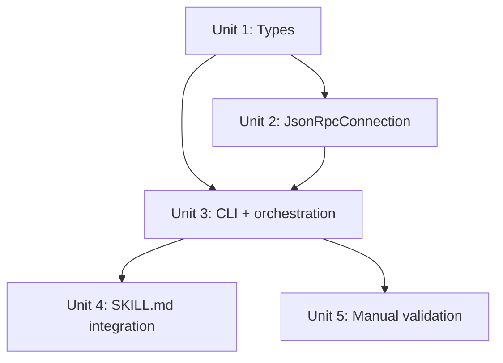

# feat: Anvil Codex app-server client

## Overview

Replace the Anvil skill's `codex exec` shell-outs with a standalone TypeScript client that speaks the `codex app-server` JSON-RPC protocol over stdio. This gives the Anvil pipeline shared thread context across review rounds, event-driven stall detection, clean turn interruption, and rate limit awareness — all capabilities that Risoluto's core already has but that `codex exec` cannot provide.

## Problem Frame

The Anvil skill's Phase 3 review loop shells out to `codex exec` for Codex rounds. Each invocation is fire-and-forget: no mid-execution visibility, no stall detection, no shared context between rounds. When Codex stalls (observed 2026-04-02 during the CI/CD pipeline brainstorm), the only option is to kill the process and lose all progress. Each round also starts fresh, forcing file-based state passing instead of letting Codex retain conversational context.

Risoluto's `src/codex/` and `src/agent/` layers solve all of these problems with a production-grade app-server integration. The Anvil skill needs the same reliability guarantees in a self-contained form at `~/.claude/skills/anvil/scripts/`. (see origin: `docs/brainstorms/2026-04-02-anvil-codex-app-server-requirements.md`)

## Requirements Trace

- R1. Spawn `codex app-server` as stdio child process, inherit auth from `~/.codex/config.toml`
- R2. Full initialization handshake (`initialize` + `initialized`)
- R3. Bidirectional JSON-RPC 2.0 connection (requests, responses, notifications, server-initiated requests)
- R4. Auto-accept all approval requests with `acceptForSession`
- R5. Thread persistence (`thread/start`, `thread/resume`) via `session-state.json`
- R6. `turn/start` with streaming `item/*` notifications until `turn/completed`
- R7. Extract final agent message from `item/completed` where `type === "agentMessage"`
- R8. `turn/steer` for injecting follow-up context during active turns
- R9. Stall detection via `lastEventAtMs` tracking (default: 180s timeout)
- R10. `turn/interrupt` on stall, then hard kill after 5s grace period
- R11. Structured error JSON to stdout on stall/error
- R12. Rate limit pre-check via `account/rateLimits/read`
- R13. Single CLI entry point with `--action`, `--plan-dir`, `--prompt-file`, `--output`, `--resume`, `--model`, `--stall-timeout`, `--cwd` flags
- R14. Exit codes: 0=success, 1=error, 2=stall, 3=rate-limited, 4=auth-failure
- R15. Structured JSON status to stdout
- R16. Process cleanup on all exit paths (normal, stall, SIGINT/SIGTERM, unhandled exception)
- R17. Total process timeout (default: 600s)

## Scope Boundaries

- Not reusable by other skills — purpose-built for Anvil
- No Docker — runs locally, no sandbox container
- No dynamic tools — no Linear/GitHub tool routing
- No auth management — inherits from `~/.codex/config.toml`
- No WebSocket — stdio only
- No npm/package.json — standalone `.ts` files run with `tsx`
- Prompt always via `--prompt-file` (shell escaping avoidance)

## Context & Research

### Relevant Code and Patterns

**Risoluto's Codex integration layer** (patterns to follow, not code to import):

| Risoluto file | Pattern to reuse |
|---|---|
| `src/codex/protocol.ts` | JSON-RPC message types, `createRequest()`, type guards |
| `src/agent/json-rpc-connection.ts` | JSONL buffered reader, pending request map with timeout, `interruptTurn()`, `close()` |
| `src/agent-runner/session-init.ts:106-158` | `initialize` → `initialized` → `account/read` → `rateLimits/read` → `thread/start` sequence |
| `src/agent-runner/session-init.ts:160-184` | `thread/resume` with fallback to `thread/start` |
| `src/agent/codex-request-handler.ts` | Auto-accept approvals pattern: `acceptForSession` for commands/files, `{ permissions, scope: "session" }` for permissions |
| `src/orchestrator/stall-detector.ts:47-101` | `lastEventAtMs` tracking, abort on silence exceeding threshold |
| `src/agent-runner/docker-session.ts:167-178` | `interruptTurn()` → wait → `close()` → kill sequence |
| `src/agent-runner/notification-handler.ts:135-169` | `item/completed` with `type === "agentMessage"` extraction pattern |

### Key Observations from Risoluto's Implementation

- **JSON-RPC `"jsonrpc":"2.0"` header is omitted on the wire** (per app-server docs). Risoluto's `protocol.ts` includes it in types but this is what the server expects.
- **`item/completed` for agentMessage** carries the full `.text` field — no need to accumulate deltas for Anvil's use case. Risoluto accumulates deltas only for live dashboard streaming.
- **Approval auto-accept** is simple: return `{ decision: "acceptForSession" }` for command/file approvals, `{ permissions, scope: "session" }` for permission requests, `{ result: null }` for user input requests.
- **Stall detector** works at the notification level — any `item/*` or `turn/*` event resets the timer. This is simpler and more reliable than polling output files.
- **Thread resume** gracefully falls back to `thread/start` on failure — important because thread IDs may expire between Claude Code sessions.

## Key Technical Decisions

- **`session-state.json` over plain `thread-id` file**: The Anvil skill needs round count, last model, and action type alongside the thread ID. A JSON state file supports this without additional files. (Resolves deferred Q1)
- **`workspaceWrite` sandbox with explicit roots**: Use `sandboxPolicy: { type: "workspaceWrite", writableRoots: [cwd, planDir], networkAccess: true }` on `thread/start`. Safe enough for local use without `danger-full-access`, and network access is needed for the proxy. (Resolves deferred Q2)
- **`item/completed` for message extraction, not delta accumulation**: Simpler code, same result. The `agentMessage` item's `text` field on completion contains the full message. (Resolves deferred Q3)
- **`--prompt-file` always, no `--prompt` flag**: Review prompts contain multi-paragraph instructions with quotes, backticks, and special characters. `--prompt-file` avoids shell escaping issues entirely. The SKILL.md already writes prompt files to `.anvil/<slug>/`. (Resolves deferred Q4)
- **No `tsconfig.json`**: Run with `tsx --no-warnings` which handles TypeScript natively. No compilation step, no build artifacts.

## Open Questions

### Resolved During Planning

- **Thread persistence format**: JSON state file (`session-state.json`) with `{ threadId, roundCount, lastModel, action }`. Supports resume and round tracking in one file.
- **Sandbox policy**: `workspaceWrite` with explicit `writableRoots` for both cwd and plan directory. Network access enabled for cliproxyapi proxy.
- **Message extraction**: Use `item/completed` with `type === "agentMessage"` — full text available, no delta accumulation needed.
- **Prompt delivery**: Always `--prompt-file`. No inline `--prompt` flag.
- **How to handle `account/read` auth check**: Mirror Risoluto's `session-init.ts:127-134` pattern — check if auth is required and if a usable account exists. Exit with code 4 if auth is required but missing.

### Deferred to Implementation

- **Exact stderr logging format**: Whether to use structured JSON logs or plain text to stderr. Decide during implementation based on what's most useful when debugging from Claude Code's Bash tool output.
- **`thread/compact/start` integration**: Not in initial scope, but if token usage grows across many rounds, may need to add compaction between turns. Defer until observed.

## High-Level Technical Design

> *This illustrates the intended approach and is directional guidance for review, not implementation specification. The implementing agent should treat it as context, not code to reproduce.*

### File Structure

```
~/.claude/skills/anvil/scripts/
├── check-deps.sh           # existing
├── codex-client.ts          # CLI entry point + arg parsing + orchestration
├── json-rpc.ts              # JsonRpcConnection class (JSONL buffered reader, request/response, notifications)
└── types.ts                 # JSON-RPC types, session state types, CLI arg types
```

Three files. The connection class is the only piece with enough complexity to warrant separation. Types are shared across both modules.

### Interaction Sequence

```
codex-client.ts                    codex app-server
     │                                    │
     ├── spawn("codex", ["app-server"])──►│
     │                                    │
     ├── initialize ──────────────────────►│
     │◄──────────────────── result ────────┤
     ├── initialized (notify) ────────────►│
     │                                    │
     ├── account/read ────────────────────►│
     │◄──────────────────── result ────────┤
     │   [exit 4 if auth required + missing]
     │                                    │
     ├── account/rateLimits/read ─────────►│
     │◄──────────────────── result ────────┤
     │   [exit 3 if usage > 95%]          │
     │                                    │
     ├── thread/start or thread/resume ───►│
     │◄──────────────────── result ────────┤
     │   [persist threadId to state file]  │
     │                                    │
     ├── turn/start ──────────────────────►│
     │◄── turn/started (notify) ──────────┤
     │                                    │
     │   ┌─ event loop ───────────────┐   │
     │   │ item/started               │   │
     │   │ item/agentMessage/delta    │   │
     │   │ item/commandExecution/*    │   │
     │   │ item/completed             │   │
     │   │ [reset lastEventAtMs]      │   │
     │   │                            │   │
     │   │ [stall timer check]        │   │
     │   │ if silent > stallTimeout:  │   │
     │   │   turn/interrupt ──────────┼──►│
     │   │   wait 5s for completed    │   │
     │   │   kill if no response      │   │
     │   └────────────────────────────┘   │
     │                                    │
     │◄── turn/completed (notify) ────────┤
     │   [extract agentMessage text]      │
     │   [write to --output file]         │
     │   [update session state]           │
     │                                    │
     ├── cleanup: close + SIGTERM ────────►│
     │                                    │
     └── stdout: { status, threadId, ... }
```

### Approval Request Handling

Server-initiated requests arrive as JSON-RPC messages with `id` and `method`. The client responds on the same stdio channel:

```
server → { id: N, method: "item/commandExecution/requestApproval", params: {...} }
client → { id: N, result: { decision: "acceptForSession" } }

server → { id: N, method: "item/fileChange/requestApproval", params: {...} }
client → { id: N, result: { decision: "acceptForSession" } }

server → { id: N, method: "item/permissions/requestApproval", params: {...} }
client → { id: N, result: { permissions: <from params>, scope: "session" } }

server → { id: N, method: "item/tool/requestUserInput", params: {...} }
client → { id: N, result: { result: null } }
```

All other unknown server requests get: `{ id: N, result: { error: { code: -32601, message: "unsupported" } } }`

## Implementation Units



- [ ] **Unit 1: Type definitions (`types.ts`)**

**Goal:** Define all shared types for the client — JSON-RPC protocol, session state, CLI args, exit codes.

**Requirements:** R3, R5, R14, R15

**Dependencies:** None

**Files:**
- Create: `~/.claude/skills/anvil/scripts/types.ts`

**Approach:**
- JSON-RPC types: `JsonRpcRequest`, `JsonRpcNotification`, `JsonRpcSuccessResponse`, `JsonRpcErrorResponse`, type guards (mirror `src/codex/protocol.ts` pattern)
- Session state: `SessionState` with `threadId`, `roundCount`, `lastModel`, `action`, `lastUpdated`
- CLI args: `CliArgs` with all R13 flags
- Exit codes: const enum `ExitCode` with `Success=0`, `Error=1`, `Stall=2`, `RateLimited=3`, `AuthFailure=4`
- Status output: `StatusOutput` matching R15 shape
- Helper: `createRequest(method, params)` with auto-incrementing ID

**Patterns to follow:**
- `src/codex/protocol.ts` — exact same JSON-RPC message shapes and type guards

**Test expectation:** none — pure type definitions with no behavioral logic beyond `createRequest()` ID counter

**Verification:**
- `tsx` can import the file without errors
- Type guards correctly discriminate request vs notification vs response shapes

---

- [ ] **Unit 2: JSON-RPC connection (`json-rpc.ts`)**

**Goal:** Bidirectional JSON-RPC connection over a child process's stdio — the core protocol layer.

**Requirements:** R1, R2, R3, R4, R9, R10, R16

**Dependencies:** Unit 1

**Files:**
- Create: `~/.claude/skills/anvil/scripts/json-rpc.ts`

**Approach:**
- Class `JsonRpcConnection` wrapping a `ChildProcessWithoutNullStreams`
- **Inbound**: Buffer `stdout` chunks, split on `\n`, parse JSON, route by shape:
  - Has `id` + `result` → resolve pending request promise
  - Has `id` + `error` → reject pending request promise
  - Has `id` + `method` → server-initiated request → call `onServerRequest` handler
  - Has `method` but no `id` → notification → call `onNotification` handler
- **Outbound**: `request(method, params)` returns a `Promise<unknown>` with per-request timeout. `notify(method, params)` sends fire-and-forget.
- **Pending map**: `Map<id, { resolve, reject, timer }>` — same pattern as `src/agent/json-rpc-connection.ts:26-34`
- **Stall timer**: `setInterval` checks `Date.now() - lastEventAtMs`. When threshold exceeded, fire the stall callback. Callback is set by the caller (orchestrator), not hardcoded in the connection.
- **Interrupt**: `interruptTurn(threadId, turnId, timeoutMs)` sends `turn/interrupt`, races against a timeout, returns boolean success
- **Cleanup**: `close()` sends SIGTERM to child. `destroy()` sends SIGKILL. Process exit listener rejects all pending promises.
- **Max line size**: 10MB (matches Risoluto's `MAX_LINE_BYTES`)

**Patterns to follow:**
- `src/agent/json-rpc-connection.ts` — nearly identical architecture. Key differences: no Docker, no `RisolutoLogger` (use stderr), stall timer is integrated into the class rather than external

**Test scenarios:**
- Happy path: send request, receive matching response by ID → promise resolves with result
- Happy path: receive notification (no ID) → `onNotification` callback fires with method and params
- Happy path: receive server request (has ID + method) → `onServerRequest` fires, response sent back
- Error path: request times out → promise rejects with timeout error, pending entry cleaned up
- Error path: child process exits while requests pending → all pending promises reject
- Error path: malformed JSON line received → logged to stderr, no crash
- Edge case: line exceeds 10MB → connection closes
- Integration: `interruptTurn` sends request and resolves true on success, false on timeout

**Verification:**
- Connection can complete a full request/response round-trip
- Stall callback fires after configured silence period
- All pending promises are rejected when child exits

---

- [ ] **Unit 3: CLI entry point and orchestration (`codex-client.ts`)**

**Goal:** Parse CLI args, spawn `codex app-server`, run the full protocol lifecycle, output structured status.

**Requirements:** R1, R2, R5, R6, R7, R8, R11, R12, R13, R14, R15, R16, R17

**Dependencies:** Unit 1, Unit 2

**Files:**
- Create: `~/.claude/skills/anvil/scripts/codex-client.ts`

**Approach:**

*Arg parsing*: Use `process.argv` with a simple hand-rolled parser (no external deps). Required: `--action`, `--plan-dir`, `--prompt-file`, `--output`. Optional: `--resume`, `--model`, `--stall-timeout`, `--cwd`.

*Spawn*: `spawn("codex", ["app-server"], { stdio: ["pipe", "pipe", "pipe"] })` — inherit `process.env` so Codex picks up `OPENAI_API_KEY` and reads `~/.codex/config.toml`.

*Initialization sequence* (mirrors `session-init.ts:106-158`):
1. `initialize` with `clientInfo: { name: "anvil", version: "1.0.0" }`, `capabilities: { experimentalApi: true }`
2. `initialized` notification
3. `account/read` → check auth, exit 4 if required but missing
4. `account/rateLimits/read` → warn at 80%, exit 3 at 95%

*Thread management*:
- If `--resume` and `session-state.json` exists in `--plan-dir`: attempt `thread/resume` with persisted ID, fall back to `thread/start`
- Otherwise: `thread/start` with `{ cwd, model, sandbox: "workspaceWrite", writableRoots: [cwd, planDir], networkAccess: true, approvalPolicy: "never", serviceName: "anvil" }`
- Persist state to `<plan-dir>/session-state.json`

*Turn execution*:
- Read prompt from `--prompt-file`
- `turn/start` with `{ threadId, input: [{ type: "text", text: prompt }] }`
- Stream notifications until `turn/completed`
- On `item/completed` where `type === "agentMessage"`: capture `.text`
- Write captured text to `--output` file
- Update `session-state.json` with incremented round count

*Server request handling* (approval auto-accept):
- Wire `onServerRequest` to the approval handler matching `codex-request-handler.ts` patterns
- `item/commandExecution/requestApproval` → `{ decision: "acceptForSession" }`
- `item/fileChange/requestApproval` → `{ decision: "acceptForSession" }`
- `item/permissions/requestApproval` → `{ permissions: <from params>, scope: "session" }`
- `item/tool/requestUserInput` → `{ result: null }`
- `account/chatgptAuthTokens/refresh` → close + exit 4
- Unknown → `{ error: { code: -32601, message: "unsupported" } }`

*Stall detection*:
- Set stall timeout callback on connection (default 180s, override with `--stall-timeout`)
- On stall: `turn/interrupt` → wait 5s → if no `turn/completed`, kill child → exit 2

*Process timeout*:
- `setTimeout` for total script timeout (default 600s, override possible)
- On fire: same as stall — interrupt → kill → exit 2

*Cleanup*:
- Register `process.on("SIGINT")` and `process.on("SIGTERM")` handlers
- Register `process.on("uncaughtException")` and `process.on("unhandledRejection")`
- All paths: close connection → SIGTERM child → wait 2s → SIGKILL if still alive

*Output*:
- On success: write `{ status: "ok", threadId, turnId, outputFile }` to stdout
- On error: write `{ status: "error"|"stall"|"rate_limited"|"auth_failure", error: "..." }` to stdout
- Set `process.exitCode` accordingly

**Patterns to follow:**
- `src/agent-runner/session-init.ts` — initialization and thread start/resume sequence
- `src/agent/codex-request-handler.ts` — approval handling switch statement
- `src/agent-runner/docker-session.ts:167-178` — interrupt → wait → kill shutdown sequence

**Test scenarios:**
- Happy path: spawn → initialize → thread/start → turn/start → item/completed with agentMessage → writes output file → exits 0 with JSON status
- Happy path: `--resume` with existing state file → attempts `thread/resume` → falls back to `thread/start` on failure → continues normally
- Error path: auth required but no account → exits 4
- Error path: rate limit at 96% → exits 3 before starting turn
- Error path: stall detected (no events for 180s) → `turn/interrupt` → exits 2
- Error path: `turn/interrupt` doesn't complete within 5s → kills child process → exits 2
- Error path: total timeout exceeded → interrupt → kill → exits 2
- Error path: child process crashes mid-turn → rejects pending, exits 1
- Edge case: `--prompt-file` doesn't exist → exits 1 with error message
- Edge case: `--plan-dir` doesn't exist → creates it (mkdir -p equivalent)
- Integration: approval request arrives during turn → auto-accepted → turn continues

**Verification:**
- `tsx scripts/codex-client.ts --action review --plan-dir /tmp/test --prompt-file /tmp/prompt.txt --output /tmp/out.md --cwd .` completes a full turn and writes output
- Structured JSON appears on stdout
- Process exits cleanly with no orphaned child processes

---

- [ ] **Unit 4: Anvil SKILL.md integration**

**Goal:** Update the Anvil SKILL.md to invoke the new client instead of `codex exec`.

**Requirements:** R13 (CLI interface matches what SKILL.md needs)

**Dependencies:** Unit 3

**Files:**
- Modify: `~/.claude/skills/anvil/SKILL.md` (Phase 3 Codex round section)

**Approach:**

Replace the current `codex exec` invocation block (SKILL.md lines ~206-223) with the new client command:

Current:
```bash
codex exec "\$plan-review .anvil/<slug>/" \
  -C "$(pwd)" \
  --full-auto \
  --add-dir .anvil/<slug> \
  -o /tmp/codex-review-output.md \
  --json
```

New:
```bash
tsx ~/.claude/skills/anvil/scripts/codex-client.ts \
  --action review \
  --plan-dir .anvil/<slug> \
  --prompt-file .anvil/<slug>/codex-prompt.txt \
  --output .anvil/<slug>/reviews/NNN-codex-round-N.md \
  --resume \
  --cwd "$(pwd)" \
  --stall-timeout 180000
```

Also update:
- The "Running a Codex round" section to describe the new invocation
- The "Flag breakdown" comment block to document the new flags
- Add `--resume` guidance: "Use `--resume` for all rounds after the first within a pipeline run. This continues the existing Codex thread so the model retains context from previous rounds."
- Add error handling guidance: "Check the exit code: 0=continue, 2=stall (retry or escalate), 3=rate limited (wait and retry), 4=auth failure (ask user to run `codex login`)."
- Update `check-deps.sh` to verify `tsx` is available

The SKILL.md also needs to write the prompt file before invoking the client. Add a step: "Write the review prompt (including `$plan-review` skill invocation) to `.anvil/<slug>/codex-prompt.txt` before calling the client."

**Test expectation:** none — documentation/configuration change

**Verification:**
- SKILL.md's Phase 3 Codex round section references the new client with correct flags
- `check-deps.sh` validates `tsx` alongside `codex`

---

- [ ] **Unit 5: Manual validation**

**Goal:** Validate the full flow end-to-end against a real `codex app-server` instance.

**Requirements:** All — this is the integration proof

**Dependencies:** Units 1-4

**Files:**
- Create: `~/.claude/skills/anvil/scripts/test-smoke.sh` (disposable test script)

**Approach:**
- Write a minimal prompt file: "Summarize this directory in 2 sentences."
- Run: `tsx scripts/codex-client.ts --action review --plan-dir /tmp/anvil-test --prompt-file /tmp/test-prompt.txt --output /tmp/test-output.md --cwd .`
- Verify: exit code 0, output file contains text, stdout contains valid JSON with `status: "ok"`
- Run again with `--resume`: verify `thread/resume` succeeds (check stderr logs)
- Test stall: set `--stall-timeout 5000` with a long-running prompt and verify it fires

The smoke script is disposable — not committed to any repo. It exists to prove the integration works before the Anvil pipeline uses it for real.

**Test expectation:** none — manual validation, not automated tests

**Verification:**
- Full round-trip completes without errors
- Resume reuses the same thread (visible in stderr logs)
- Stall detection fires within the configured timeout
- No orphaned `codex` processes after exit

## System-Wide Impact

- **Interaction graph:** The client is invoked by the Anvil SKILL.md (Claude Code's Bash tool) and talks to `codex app-server` (local process). No other systems are affected. The client writes to `.anvil/<slug>/` (review files, session state) which the Anvil skill already manages.
- **Error propagation:** Client errors surface as exit codes + structured JSON on stdout. The Anvil SKILL.md reads these and decides whether to retry, escalate, or abort. No errors propagate beyond the SKILL.md's error handling.
- **State lifecycle risks:** `session-state.json` could become stale if Codex purges old threads. The `thread/resume` → `thread/start` fallback handles this gracefully.
- **Unchanged invariants:** Risoluto's Codex integration (`src/codex/`, `src/agent/`) is completely untouched. The Anvil skill's pipeline phases, ledger format, and review file naming are unchanged.

## Risks & Dependencies

| Risk | Mitigation |
|------|------------|
| `codex app-server` startup time adds latency vs `codex exec` | The initialization sequence (handshake + auth check + rate limit check) adds ~2-3s but stall detection saves far more time on failures |
| Thread IDs expire between Claude Code sessions | `thread/resume` → `thread/start` fallback. Session state file tracks this gracefully |
| `tsx` not available on user's machine | `check-deps.sh` already validates CLI tools. Add `tsx` check there |
| Breaking changes in `codex app-server` protocol | Client uses stable methods only (no `experimentalApi`-gated methods beyond init). Pin to known-working Codex CLI version in skill docs |
| `cliproxyapi` proxy not running when Anvil starts | Client will fail at `account/read` or first turn. Error message should suggest checking the proxy |
| `codex app-server` hangs during startup (never sends ready signal) | The `initialize` request has the same per-request timeout as all other requests. If it times out, the client exits with code 1. Risoluto additionally uses `waitForStartup()` to detect stderr readiness — evaluate if needed during implementation |

## Sources & References

- **Origin document:** [docs/brainstorms/2026-04-02-anvil-codex-app-server-requirements.md](docs/brainstorms/2026-04-02-anvil-codex-app-server-requirements.md)
- Risoluto JSON-RPC connection: `src/agent/json-rpc-connection.ts`
- Risoluto protocol types: `src/codex/protocol.ts`
- Risoluto session init: `src/agent-runner/session-init.ts`
- Risoluto request handler: `src/agent/codex-request-handler.ts`
- Risoluto stall detector: `src/orchestrator/stall-detector.ts`
- Risoluto notification handler: `src/agent-runner/notification-handler.ts`
- Codex app-server docs: shared by Omer 2026-04-02
- Codex CLI reference: saved to memory `reference_codex_cli.md`
