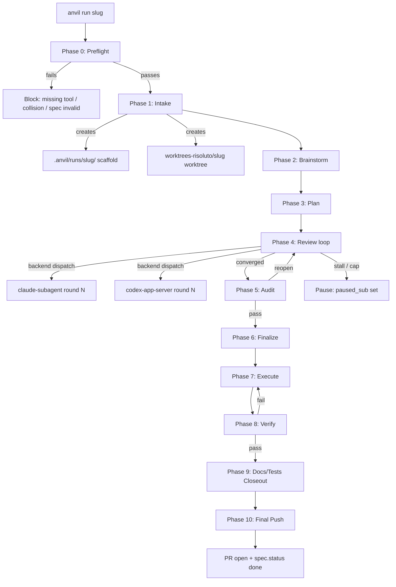
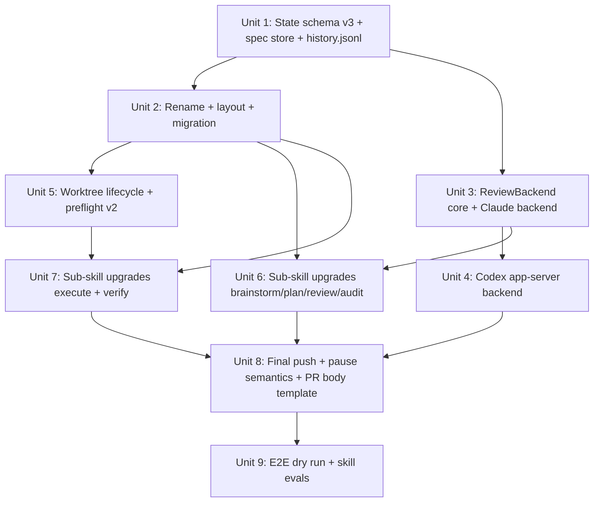

# feat: Anvil v2 — solo-spec factory with pluggable review backends

## Overview

Replace `.agents/skills/anvil-risoluto/` (Codex-centric, bundled execution) with a
model-agnostic, solo-spec Claude Code skill at `.agents/skills/anvil/`. Each
`anvil run <slug>` consumes one spec from `.anvil/specs/<slug>/`, runs the full
10-phase factory in its own git worktree at `../worktrees-risoluto/<slug>/`, and
produces one PR ready to merge main. Review is pluggable across Claude subagents,
Codex app-server, and OpenCode SDK. UI-touching specs run a mandatory 6-layer
verification battery. The factory never fails — it grinds until a PR ships or
pauses with a concrete unblocker for Omer.

## Problem Frame

Risoluto ships today via bundled runs that gather 10-18 units onto one
integration branch. Three recurring failures make this costly: coarse rollback
blast radius, reviewer fatigue on huge PRs, and conflict amplification across
siblings touching adjacent files. Upstream work items also live in GitHub issues,
which forces `gh` CLI round-trips, offers no schema enforcement, and lacks a
per-item observability trail.

Anvil v2 inverts the model (one spec → one worktree → one branch → one PR),
moves the work library local (`.anvil/specs/<slug>/` with `spec.json` strict
schema, `spec.md` rich context, `history.jsonl` append-only event log), and
replaces the Codex-locked review loop with a `ReviewBackend` interface so any
LLM provider can plug in. Parallelism is a human concern (multiple Claude Code
sessions), not a skill concern.

(see origin: `docs/brainstorms/2026-04-04-anvil-v2-requirements.md`)

## Requirements Trace

This plan satisfies the 42 requirements from the origin document, grouped for
readability. Every implementation unit below cites the specific Rn identifiers
it advances.

- **Spec Store (R1-R7)** — `.anvil/specs/<slug>/` layout, strict `spec.json`
  schema with verifiable DoD, rich `spec.md`, append-only `history.jsonl`,
  versioned schema with forward migration, GitHub issue retirement.
- **Anvil Factory (R8-R15)** — 10-phase pipeline, fresh run records at
  `.anvil/runs/<slug>/` per invocation, state in main repo with worktrees as
  siblings, `status.json` with `paused_sub` field, single-push guarantee,
  auto-generated PR body.
- **Pluggable Review Backends (R16-R21)** — `.anvil/config.json`-driven backend
  selection, `ReviewBackend` interface, three shipping backends (Claude
  subagent, Codex app-server, OpenCode SDK), availability fallback vs crash
  pause, 10-round cap.
- **UI Verification Battery (R22-R26)** — mandatory 6-layer battery when
  `touches_ui: true`, blocking layers 1-5 with advisory layer 6, dogfood
  severity routing, preflight tool checks, verification artifacts scoped to
  `runs/<slug>/verification/`.
- **State Machine & Failure Semantics (R27-R30)** — `draft → ready → in-progress
  → done` with no `failed` state, `paused_sub: paused_awaiting_human` substate,
  eight explicit pause triggers, manual abort creates fresh run record.
- **Observability (R31-R33)** — every mutation emits a `history.jsonl` event,
  auto-generated PR body from spec + run state + evidence, internal consistency
  between `status.json` / `handoff.md` / `closeout.md` / `pipeline.log`.
- **Migration & Skill Upgrade (R34-R39)** — `git mv` rename of
  `anvil-risoluto → anvil`, in-place upgrade of six phase sub-skills, delete
  obsolete references, create new references and scripts, migrate historical
  `.anvil/<slug>/` dirs.
- **Invocation & Session Model (R40-R42)** — single `anvil run <slug>`
  invocation, no in-session fanout, worktree collision detection at preflight.

## Scope Boundaries

Explicit non-goals that the origin document already excludes. This plan honors
them strictly — the confidence check in Phase 5 will flag any unit that smuggles
scope back in.

- Layer 1 spec creation skills (research agent, brainstorm-to-spec, bug-to-spec)
  — separate brainstorm
- `repo-research.md` v2 rewrite to target the spec store — deferred
- Multi-spec batch invocation (`anvil run-all`) — deferred to v1.1
- Background queue watcher daemon — deferred
- Web / MCP research sources beyond GitHub — deferred
- Observability dashboard or query UI over `history.jsonl`
- Retroactive spec records for historical bundled runs
- Personal `/anvil` at `~/.agents/skills/anvil/` — out of this repo
- Cost tracking per run
- Spec-level auto-retry across runs

## Context & Research

### Relevant Code and Patterns

**Port/adapter pattern to mirror for `ReviewBackend`:**

| Risoluto file | Pattern |
|---|---|
| `src/tracker/port.ts` | `TrackerPort` interface shape, method signature conventions, named types for inputs/outputs |
| `src/tracker/factory.ts` | `createTracker(getConfig, logger)` factory dispatching on `config.tracker.kind`, returns `{ tracker, linearClient }` |
| `src/core/types.ts` | `TrackerConfig` embedded in `ServiceConfig`; analogous `ReviewBackendsConfig` shape for `.anvil/config.json` |
| `src/dispatch/factory.ts` | `createDispatcher()` — factory returning `RunAttemptDispatcher` based on `DISPATCH_MODE` env var |

The anvil skill's `ReviewBackend` implementation is standalone (not imported from
`src/`) but mirrors the same structure: interface in
`.agents/skills/anvil/scripts/review-backend/port.ts`, factory in
`review-backend/factory.ts`, config in `.anvil/config.json`. This preserves the
precedent set by the 2026-04-02 Codex app-server plan: "Reuses Risoluto's
architectural patterns but shares no code."

**Codex JSON-RPC patterns to mirror in the Codex backend:**

| Risoluto file | Pattern |
|---|---|
| `src/agent/json-rpc-connection.ts` | JSONL buffered reader, pending request map, `interruptTurn()`, `close()` — full connection lifecycle |
| `src/codex/protocol.ts` | JSON-RPC message type definitions, `createRequest()`, type guards |
| `src/agent-runner/session-init.ts:106-158` | `initialize → initialized → account/read → rateLimits/read → thread/start` sequence |
| `src/agent-runner/session-init.ts:160-184` | `thread/resume` with fallback to `thread/start` |
| `src/agent/codex-request-handler.ts` | Auto-accept pattern: `acceptForSession` for commands/files, `{ permissions, scope: "session" }` for permissions |
| `src/orchestrator/stall-detector.ts:47-101` | `lastEventAtMs` tracking, abort on silence exceeding threshold |
| `src/agent-runner/docker-session.ts:167-178` | `interruptTurn() → wait → close() → kill` shutdown sequence |
| `src/agent-runner/notification-handler.ts:135-169` | `item/completed` with `type === "agentMessage"` text extraction |

**Worktree patterns** (for reference only — anvil's worktree scripts are standalone):

| Risoluto file | Pattern |
|---|---|
| `src/git/worktree-manager.ts` | `addWorktree`, `removeWorktree`, `listWorktrees`, `isWorktreeClean`, `branchExists` — full lifecycle module |

**State schema baseline:**

- `.agents/skills/anvil-risoluto/scripts/state.ts` — current `schema_version: 2`
  with normalization/migration logic. V2 extends this to `schema_version: 3`
  with `paused_sub` field.

**Existing scripts to adapt:**

- `.agents/skills/anvil-risoluto/scripts/init_anvil_run.ts` → `scripts/init_run.ts`
  (writes to `runs/<slug>/` instead of `<slug>/`, reads from `specs/<slug>/` for
  touches matrix).
- `.agents/skills/anvil-risoluto/scripts/preflight.ts` → `scripts/preflight.ts`
  (reads from `spec.json` instead of `bundle.json`, inverts worktree check to
  collision detection, adds UI tool presence checks).
- `.agents/skills/anvil-risoluto/scripts/resolve_bundle.ts` → **deleted**
  (specs replace bundles).
- `.agents/skills/anvil-risoluto/scripts/update_status.ts` → unchanged in shape,
  migrates automatically via the updated `state.ts`.

### Institutional Learnings

- `docs/solutions/` does not exist yet in this repo — no central institutional
  learning library to cite. The equivalents live in:
  - `.claude/projects/-home-oruc-Desktop-workspace-risoluto/memory/` (auto-memory):
    `feedback_parallel_workers.md`, `feedback_pre_push_hooks.md`,
    `feedback_parallel_limit.md` (max 5 concurrent worktree agents),
    `project_anvil_skill.md` (3 battle tests history), `reference_codex_cli.md`,
    `reference_codex_app_server.md`.
  - Prior brainstorms: `docs/brainstorms/2026-04-02-anvil-codex-app-server-requirements.md`
    (provides Codex app-server requirements that this plan absorbs).
- Key learning from memory: SKIP_HOOKS was required for merge commits during
  prior battle-test execution when commitlint hooks referenced not-yet-installed
  deps. This hints at a risk in the anvil-execute upgrade — keep hook handling
  honest, never bypass hooks without explicit reason recorded.
- Key learning from memory: Codex background tasks sometimes silently fail
  (0-byte output). The Codex app-server backend must never assume completion
  based on absence of error — it must verify turn completion via notification.

### External References

- **Existing plan being absorbed:**
  `docs/plans/2026-04-02-002-feat-anvil-codex-app-server-plan.md` (status:
  active, unimplemented). Its 5 implementation units (types, JsonRpcConnection,
  CLI+orchestration, SKILL.md integration, manual validation) map directly into
  **Unit 4 (Codex app-server backend)** of this plan. On implementation, the
  2026-04-02-002 plan should be marked `status: superseded` with a pointer to
  this plan.
- **Impeccable skill family** at `~/.agents/skills/{critique,audit,polish,...}/`
  — advisory Layer 6 of the UI battery. Already installed, referenced from the
  current `anvil-verify/SKILL.md`.
- **External tooling for UI battery** (all need preflight presence checks):
  - `npx expect-cli` — millionco/expect — diff-driven browser testing
  - `@browserbasehq/browse-cli` — browserbase/skills/ui-test — adversarial
    structured testing
  - `agent-browser` — vercel-labs/agent-browser — exploratory QA with
    screenshot/video evidence

### Discovered Infrastructure Constraints

1. **Playwright dev server port is hardcoded to 5173** in `playwright.config.ts`.
   Parallel anvil sessions would collide on this port. The worktree script
   must allocate a deterministic port offset per spec slug.
2. **`.github/workflows/ci.yml`** already runs the quality gate in CI. The
   anvil `execute` and `verify` phases run the equivalent local gate without
   duplicating CI logic.
3. **No pluggable review backend exists** in the current codebase — anvil v2
   establishes this pattern for the first time in the project.
4. **No `docs/solutions/` directory** — institutional learnings live in auto-
   memory and prior brainstorms. Consider creating `docs/solutions/` in a
   separate initiative to consolidate.

## Key Technical Decisions

- **Directory-per-spec over flat markdown files**: Each spec is a directory
  holding `spec.json` (machine-readable), `spec.md` (rich context),
  `history.jsonl` (event log), and `attachments/`. Enables strict schema
  validation, full observability, and rich context in one place. The flat
  markdown alternative (considered earlier in brainstorm) loses schema
  enforcement and per-item history.
- **Run records separate from specs** (`.anvil/runs/<slug>/` vs
  `.anvil/specs/<slug>/`): Fresh run record per invocation (`runs/<slug>-N/`
  when prior runs exist). Spec is immutable intent; run is immutable history
  of one attempt. Retries don't corrupt previous runs' audit trail.
- **State lives in main repo, not worktree**: The anvil orchestrator runs in
  main repo context. Agents working in the worktree receive `ANVIL_STATE_DIR`
  and `ANVIL_WORKTREE_DIR` env variables. This keeps a single source of truth
  and avoids syncing state across worktrees.
- **Sibling worktree directory**: `../worktrees-risoluto/<slug>/` rather than
  `.worktrees/<slug>/` inside the repo. Avoids `.gitignore` pollution and
  matches the "state in main, code in worktree" split.
- **Schema version 3 for `status.json`**: Adds `paused_sub` object, keeps
  backward-compatible normalization from v2 (current `state.ts` already
  handles forward migration). Legacy v1/v2 status files auto-migrate on read.
- **`ReviewBackend` interface in anvil skill, not `src/`**: Three concrete
  reasons, not just precedent. (1) The skill must run against worktrees where
  Risoluto core code may be mid-rewrite or have compile errors — importing
  from `src/` would break the skill whenever the code it orchestrates is
  temporarily broken. (2) The skill runs a `.ts` file via `tsx` without a
  `tsconfig.json` or build step, so it cannot import paths that need
  compilation. (3) The skill ships with the repo but must stay functional
  across Risoluto version upgrades — coupling to `src/` creates a hidden
  version dependency that would surface as mysterious failures after any
  refactor of the port layer. Mirrors `TrackerPort`'s interface shape but
  re-implements it in-skill for these three reasons.
- **Silent fallback on `available()` false, pause on runtime crash**:
  Availability checks are expected (Codex CLI may not be installed) and fall
  back to the configured default (`claude-subagent`). Runtime crashes mid-round
  are exceptional and break the cross-model diversity guarantee, so they pause
  the run for explicit human intervention. This is stricter than the current
  Codex-only anvil, which has no diversity guarantee to protect.
- **Port allocation via slug hash**: `BASE_PORT + (hash(slug) % 100)` gives 100
  deterministic slots. Slug-derived is stable across restarts (resuming a
  paused run uses the same port). Collision detection at preflight catches
  hash collisions (rare in practice for slug strings with >6 chars).
- **10-phase pipeline preserved, not collapsed**: Earlier in brainstorm a
  7-phase collapse was considered (skip brainstorm/plan because specs are
  execution-ready). Round 3 reverted this for three concrete reasons. (1) Specs
  may sit in `ready` status for days or weeks before being dispatched; by the
  time `anvil run` fires, main has drifted and the spec's file references
  may be stale. Brainstorm validates the spec against current repo state and
  fails fast if drift has broken it. (2) The review loop catches plan-level
  mistakes that brainstorm didn't anticipate — wrong module target, missing
  edge case, infeasible sequencing. Skipping review means those mistakes land
  in the PR. (3) Audit as a fresh-context check catches "agreement collapse"
  where both reviewers converge on the same blind spot. Without audit, any
  shared assumption in the spec would slip through. The cost of 4 extra
  phases (brainstorm, plan, review, audit) is ~15-20 minutes per run on
  typical specs, which is an acceptable price for these three quality
  guarantees.
- **"Always succeeds" with sharp pause triggers, not infinite loops**: The
  factory keeps grinding, but eight explicit pause conditions (caps, stall
  detector, incoherence detector, backend crash, spec validation) prevent
  token-wasting infinite loops. Pauses are refinements, not failures — the
  spec stays `in-progress`, only `status.json.active` flips to false.
- **Absorbing the 2026-04-02-002 Codex app-server plan as Unit 4 subtasks**:
  That plan is not yet implemented. Its 5 units map cleanly to the Codex
  backend subtasks here. Duplicate planning would be waste. When Unit 4 is
  executed, the old plan's status should be updated to `superseded` with a
  pointer to this plan (recorded as an implementation note, not part of the
  plan itself).

## Open Questions

### Resolved During Planning

- **Exact `spec.json` v1 schema** (origin R2): Resolved during Unit 1 below —
  the implementer will publish `references/spec-schema.md` with a full JSON
  Schema file. The schema contains the fields enumerated in origin R2 plus
  a `ui_battery_config` object for per-spec overrides (e.g., `dogfood.enabled:
  false` for non-dashboard UI changes).
- **`status.json` v3 schema changes** (origin R12): Add `paused_sub: { trigger,
  unblocker, since } | null`. Repurpose `integration_branch` as the PR branch
  (no distinction in solo runs; current semantics apply verbatim). Schema
  version bump from 2 → 3. Normalization in `state.ts` handles legacy v1/v2.
- **Worktree cleanup policy**: Delete on successful push (Phase 10). Preserve
  on pause so Omer can inspect state. Controlled by
  `.anvil/config.json.worktree.cleanup_on_success` (default `true`). Emergency
  cleanup via `scripts/cleanup_worktree.ts <slug> --force`.
- **Port allocation**: `5173 + (stable_hash(slug) % 100)` for Playwright dev
  server. `6173 + offset` reserved for `/expect` if it starts its own server.
  Collision detection at preflight inspects running anvil worktrees and
  refuses to start if another active run is using the same computed port.
- **PR description template** (origin R32): Resolved in Unit 8 — a Liquid/Mustache
  template at `references/pr-body-template.md`. Rendered at Phase 10 from
  `spec.md`, `status.json`, `claims.md`, and verification artifacts.
- **Stall detector algorithm** (origin R29.b): Compare rounds N-2, N-1, N by
  `{settled, contested, open}` counts AND the hash of the top contested point's
  identifier. If all three rounds match on both, pause with `trigger:
  review_stall`. "Identical ledger" tolerates whitespace and wording changes but
  not content changes.
- **Incoherence detector algorithm** (origin R29.d): Compare execute cycles
  N-1 and N by `(file_path, diff_sign)` tuples where `diff_sign = hash(diff)`.
  If cycle N's diffs are the reverse of cycle N-1 on ≥70% of files (sign
  inversion), pause with `trigger: execution_thrash`.
- **`ReviewBackend` interface signatures**: Resolved in Unit 3 — the interface
  lives in `.agents/skills/anvil/scripts/review-backend/port.ts`. Methods:
  `name: string`, `available(): Promise<boolean>`, `review(opts:
  ReviewOptions): Promise<ReviewResult>`. Types in `review-backend/types.ts`.
- **Migration script design**: Resolved in Unit 2 — reads each existing
  `.anvil/<slug>/status.json`, maps to new schema, copies artifacts to
  `.anvil/runs/<slug>/`, does NOT retroactively create specs (historical runs
  have no spec of record; they were bundle-driven). Copies `.anvil/ACTIVE_RUN`
  if present to the new layout. Refuses to run if the target already has
  content (idempotent safety).
- **`dogfood` severity routing** (origin R24): HIGH severity reopens execute;
  MEDIUM becomes PR advisory note; LOW logs only. "Severity" comes from the
  dogfood report's own counts — the `/dogfood` skill produces a report with
  per-issue severity. The anvil verify phase parses this report and routes.

### Deferred to Implementation

- **Exact stderr logging format for anvil scripts**: Structured JSON vs plain
  text. Decide during Unit 1 implementation based on what's most useful when
  debugging from Claude Code Bash tool output.
- **`thread/compact/start` integration for Codex backend**: Not in v1 scope.
  If token usage grows across many review rounds in practice, add compaction
  between turns. Defer until observed.
- **Exact Impeccable skill subset to invoke at Layer 6**: The current
  `dependency-contract.md` lists 17 Impeccable follow-up skills. The verify
  phase should invoke diagnostic entry points (`/critique`, `/audit`) and
  route to follow-ups dynamically based on findings. Implementer chooses the
  routing logic during Unit 7 based on what the diagnostic tools return.
- **`/expect` CI mode cookie handling across worktrees**: Origin open question.
  `expect-cli --ci --no-cookies` skips system cookies; if Risoluto's dashboard
  needs auth in dev mode, the implementer will wire a test fixture. Defer
  until Unit 7 hits it.
- **`/ui-test` step budget tuning**: Start with 25 (small bugfix), 40 (medium
  feature), 75 (dashboard rework). Tune during first real runs. Budget is a
  per-spec override in `spec.json.ui_battery_config.ui_test.step_budget` or
  defaults from `.anvil/config.json`.
- **`/dogfood` finding → severity mapping**: Needs a first run against a real
  Risoluto dashboard change to calibrate. Implementer will establish the
  mapping during Unit 7 manual validation.
- **Exact per-sub-skill diff for `anvil-brainstorm/plan/review/audit/execute/verify`**:
  Captured at unit level (Units 6, 7) but the exact SKILL.md line-by-line
  edits emerge during implementation as the implementer reads each file in
  context.
- **`anvil-brainstorm` SKILL.md rewrite scope**: Origin R35 says strip Codex
  references. The current file has few Codex references directly; most
  Codex-specific bits live in `references/bundle-intake.md` (deleted) and
  references to `repo_mapper`/`plan_reviewer` Codex agent pool. Replace the
  Codex agent pool references with Claude Code subagent dispatch.
- **Detecting worktree collisions on file boundaries** (origin R42): Requires
  parsing `spec.json.dependencies.file_overlap` fields from all running specs.
  Resolved: read each `runs/*/status.json` where `active: true`, join to its
  corresponding `specs/<slug>/spec.json`, and compare file sets. If overlap,
  block preflight. Exact algorithm implemented in Unit 5.

## High-Level Technical Design

> *This illustrates the intended approach and is directional guidance for
> review, not implementation specification. The implementing agent should
> treat it as context, not code to reproduce.*

### ReviewBackend interface (mirrors TrackerPort pattern)

```text
.agents/skills/anvil/scripts/review-backend/
├── port.ts           # ReviewBackend interface + types
├── factory.ts        # createReviewBackend(config) dispatcher
├── claude-subagent.ts   # Claude Code Agent tool backend (always available)
├── codex-app-server.ts  # Codex JSON-RPC stdio backend
├── opencode-sdk.ts      # OpenCode HTTP REST backend (optional, stub in v1)
└── dispatcher.ts     # Round-by-round backend selection + fallback

interface ReviewBackend {
  name: string                              // "claude-subagent" | "codex-app-server" | "opencode-sdk"
  available(): Promise<boolean>             // can this backend run right now?
  review(opts: ReviewOptions): Promise<ReviewResult>
}

interface ReviewOptions {
  planPath: string
  ledgerPath: string
  reviewsDir: string
  roundNumber: number
  cwd: string
  persona: "hostile" | "constructive" | "counter"
  stallTimeoutMs?: number
  model?: string
}

interface ReviewResult {
  score: number                             // 0-10
  verdict: "GO" | "CONDITIONAL_GO" | "NO_GO"
  settled: number
  contested: number
  open: number
  outputPath: string                        // path to the round's review markdown
}
```

### Anvil run lifecycle



### State layout

```text
risoluto/                                   main repo, state lives here
├── .anvil/
│   ├── config.json                         review backends, worktree, caps
│   ├── specs/
│   │   └── <slug>/
│   │       ├── spec.json                   strict v1 schema
│   │       ├── spec.md                     rich context
│   │       ├── history.jsonl               append-only event log
│   │       └── attachments/
│   ├── runs/
│   │   └── <slug>/                         or <slug>-N for retries
│   │       ├── status.json                 v3 schema
│   │       ├── pipeline.log
│   │       ├── handoff.md
│   │       ├── closeout.md
│   │       ├── plan.md                     Phase 3 output
│   │       ├── ledger.md                   Phase 4 review settlements
│   │       ├── claims.md                   Phase 8 verifiable claims
│   │       ├── verify-charter.md
│   │       ├── docs-impact.md
│   │       ├── tests-impact.md
│   │       ├── reviews/                    per-round artifacts
│   │       ├── execution/                  manifest, merge log
│   │       └── verification/
│   │           ├── screenshots/
│   │           └── videos/
│   └── ACTIVE_RUN                          latest active run slug (optional)
└── .agents/skills/anvil/                   the skill (renamed from anvil-risoluto)

../worktrees-risoluto/                      sibling dir
└── <slug>/                                 full checkout on feat/<slug>
    └── ...                                 no .anvil/ here
```

## Implementation Units

Phased delivery with 9 units. The dependency graph below shows which units
unblock which.



---

### Phase 1: Foundation

- [ ] **Unit 1: State schema v3, spec store scaffold, history.jsonl**

**Goal:** Establish the data layer for anvil v2 — the strict spec.json schema,
the updated status.json v3 schema with `paused_sub`, the append-only history
log system, and the validator/writer scripts that every other unit depends on.

**Requirements:** R1, R2, R3, R4, R5, R6, R12, R27, R31

**Dependencies:** None

**Files:**
- Create: `.agents/skills/anvil/references/spec-schema.md` (full JSON Schema
  + worked examples, including required spec.md section list per R4 —
  Problem, Prior Art, Design Sketch, Affected Modules, Open Questions)
- Create: `.agents/skills/anvil/references/state-contract.md` (status.json v3
  contract, replaces `anvil-risoluto/references/state-contract.md` pointer)
- Create: `.agents/skills/anvil/scripts/validate_spec.ts`
- Create: `.agents/skills/anvil/scripts/append_history.ts`
- Modify: `.agents/skills/anvil/scripts/state.ts` (bump schema_version to 3,
  add `paused_sub` normalization, keep forward migration from v1/v2)
- Create: `tests/anvil/validate_spec.test.ts`
- Create: `tests/anvil/state.test.ts`
- Create: `tests/anvil/append_history.test.ts`

**Approach:**
- `spec-schema.md` documents the JSON Schema for `spec.json` v1. Fields exactly
  per origin R2, with `ui_battery_config` object for per-spec overrides
  (`dogfood.enabled`, `expect.timeout_ms`, `ui_test.step_budget`). Every AC
  entry requires a `verify` field (runnable command or file assertion).
- The same `references/spec-schema.md` also documents the required markdown
  sections for `spec.md` per origin R4: Problem, Prior Art (when sourced from
  research), Design Sketch, Affected Modules, Open Questions. `validate_spec.ts`
  checks for these section headers and warns (not errors) if any are missing —
  a spec can still validate if a section is genuinely N/A, but the validator
  surfaces the absence so authors can confirm intent.
- Status enum values enforced by schema (origin R27): `draft`, `ready`,
  `in-progress`, `done`. No `failed` value — the schema itself enforces this
  invariant.
- `validate_spec.ts` reads `spec.json`, validates against schema, reports
  errors with field paths. Called by preflight and by CI to lint specs in
  `.anvil/specs/`. Uses Zod for schema definition (matches Risoluto's convention
  in `src/http/request-schemas.ts`).
- `state.ts` normalization extends the existing v2 logic: adds `paused_sub`
  field with shape `{ trigger: PauseTrigger | null, unblocker: string | null,
  since: string | null }`. Legacy v1/v2 status files get `paused_sub: null`
  on read. Enum of pause triggers: `review_cap`, `review_stall`, `audit_cap`,
  `execution_thrash`, `gate_cap`, `verify_cap`, `spec_validation`,
  `backend_crash`.
- `append_history.ts` appends a single JSON line to `.jsonl` with `ts`
  (ISO 8601), `event` (enum), `actor` (string), and event-specific fields.
  Events: `created`, `field_updated`, `status_changed`, `run_phase`,
  `review_round`, `pause_triggered`, `pause_resolved`, `run_complete`,
  `migrated_from_legacy_layout`. Opens with `'a'` flag; on POSIX filesystems,
  single `write(2)` calls below `PIPE_BUF` (4096 bytes on Linux) are atomic,
  which holds for normal single-line JSON events. Lines exceeding 4KB use a
  per-file lock via a sidecar `history.jsonl.lock` file to serialize appends
  across parallel anvil sessions writing to the same spec's history.
- **Every phase transition must emit a `run_phase` history event** via
  `append_history.ts`. This is not enforced by state.ts; it is a contract
  that each sub-skill's SKILL.md must follow. Units 6 and 7 add these calls
  to each sub-skill as part of the upgrade. `append_history.ts` is the
  single entry point — no phase writes to `history.jsonl` directly.
- Tests cover every schema field, normalization of legacy v1/v2 files, malformed
  JSON rejection, concurrent-append safety.

**Patterns to follow:**
- `.agents/skills/anvil-risoluto/scripts/state.ts` — existing normalization
  logic to extend. Keep the `normalizeStatus`, `readStatus`, `writeStatus`,
  `patchStatus` entry points.
- `src/config/schemas/*.ts` — Zod schema conventions
- `src/core/types.ts` — domain type naming (camelCase functions/variables,
  PascalCase types, interfaces over type aliases for object shapes)

**Test scenarios:**
- Happy path: `validate_spec.ts` reads a well-formed `spec.json` → exits 0,
  no output
- Happy path: `validate_spec.ts` reads a minimal valid spec (required fields
  only) → exits 0
- Error path: missing required field (e.g., `title`) → exits 1, prints field
  path
- Error path: `acceptance_criteria` entry missing `verify` field → exits 1,
  cites the specific AC index
- Error path: `status` field outside enum (`in_progress` with underscore
  instead of hyphen) → exits 1
- Edge case: `scope.touches_ui` boolean false → valid, no battery required
- Edge case: `spec.json` file does not exist → exits 1 with clear file-not-found
  message
- Happy path: `state.ts` reads a v2 status.json → normalizes to v3, adds
  `paused_sub: null`, returns normalized object
- Happy path: `state.ts` `writeStatus()` round-trips — write, read back,
  compare, equal
- Integration: `append_history.ts` writes to a fresh `history.jsonl` → file
  exists with exactly one line, valid JSON, contains `ts` and `event` fields
- Integration: two serial `append_history.ts` invocations → file has 2 lines,
  each a valid JSON record
- Edge case: `append_history.ts` called with invalid event name → exits 1
  before writing

**Verification:**
- `pnpm run build` passes with the new files
- `pnpm run lint` passes (no ESLint errors)
- `pnpm test tests/anvil/` all green
- `validate_spec.ts` rejects a hand-crafted broken spec and accepts a valid one
- A legacy `.anvil/notifications-bundle/status.json` (schema v2) still reads
  cleanly after migration

---

- [ ] **Unit 2: Rename `anvil-risoluto → anvil`, layout restructure, migration script**

**Goal:** Physically restructure the skill tree and migrate existing `.anvil/<slug>/`
historical runs to the new `.anvil/runs/<slug>/` layout. Preserves git history
via `git mv`. No behavior change yet — this unit is about moving files to their
new homes and making the historical runs readable under the new paths.

**Requirements:** R9, R10, R34, R35, R36, R38

**Dependencies:** Unit 1 (state.ts v3 normalization must exist for migration)

**Files:**
- Rename (git mv): `.agents/skills/anvil-risoluto/` → `.agents/skills/anvil/`
- Delete: `.agents/skills/anvil/references/bundle-intake.md`
- Delete: `.agents/skills/anvil/references/codex-context-budget.md`
- Delete: `.agents/skills/anvil/scripts/resolve_bundle.ts`
- Create: `.agents/skills/anvil/references/migration.md` (document the upgrade,
  help future contributors understand the structural change)
- Create: `.agents/skills/anvil/scripts/migrate_old_state.ts`
- Modify: `.agents/skills/anvil/SKILL.md` (update all cross-references from
  `anvil-risoluto` to `anvil`, update directory paths from `.anvil/<slug>/`
  to `.anvil/runs/<slug>/`)
- Modify: `.agents/skills/anvil-brainstorm/SKILL.md`, `anvil-plan/SKILL.md`,
  `anvil-review/SKILL.md`, `anvil-audit/SKILL.md`, `anvil-execute/SKILL.md`,
  `anvil-verify/SKILL.md` — update all `../anvil-risoluto/references/...`
  pointers to `../anvil/references/...`
- Modify: `.agents/skills/anvil/scripts/init_anvil_run.ts` →
  `.agents/skills/anvil/scripts/init_run.ts` (writes to `.anvil/runs/<slug>/`,
  reads touches matrix from `.anvil/specs/<slug>/spec.json`)
- Modify: `CLAUDE.md` (update any references to `anvil-risoluto`; current
  CLAUDE.md cites it in the Architecture Deep Dive module map — grep and fix)
- Create: `tests/anvil/migrate_old_state.test.ts`

**Approach:**
- Use `git mv` for the directory rename to preserve history. One commit per
  logical step (rename, delete obsolete refs, update pointers).
- `migrate_old_state.ts` takes each existing `.anvil/<slug>/` dir (not `specs/`,
  `runs/`, or `ACTIVE_RUN`), moves its contents to `.anvil/runs/<slug>/`, and
  rewrites `status.json` to schema v3 via `state.ts` normalization. Idempotent:
  skips directories that are already under the new layout.
- Historical runs do NOT get retroactive spec records — they were bundle-driven
  and the spec schema assumes a single-issue-equivalent item. The migration
  logs this explicitly in each run's `history.jsonl` with event
  `migrated_from_legacy_layout`.
- `init_run.ts` reads `.anvil/specs/<slug>/spec.json` (not `bundle.json`) to
  populate initial status. The `touches_*` fields move from the bundle into
  the spec's `scope` object.
- `SKILL.md` cross-references: the phase sub-skills currently read
  `../anvil-risoluto/references/output-contract.md`. After rename, the path
  becomes `../anvil/references/output-contract.md`. Grep-and-fix across all 6
  sub-skills.

**Patterns to follow:**
- Existing `init_anvil_run.ts` structure — keep the same file layout (reviews/,
  execution/, verification/ subfolders), just under the new parent path.
- Use `fs.promises.rename` (equivalent to `mv`) for directory moves in the
  migration script. Atomicity is filesystem-dependent but good enough on Linux.
- Preserve the slug validation logic from `init_anvil_run.ts` (no path
  separators, no `..`, resolve-path check).

**Test scenarios:**
- Happy path: `init_run.ts <slug>` with existing `.anvil/specs/<slug>/spec.json`
  → creates `.anvil/runs/<slug>/status.json`, `pipeline.log`, `handoff.md`,
  subfolders
- Happy path: `migrate_old_state.ts` run against a fixture with old-layout
  `.anvil/<fake-slug>/` → directory moves to `.anvil/runs/<fake-slug>/`,
  status.json has schema_version 3, history.jsonl has migration event
- Happy path: `migrate_old_state.ts` run twice → second run is no-op
  (idempotent)
- Error path: `init_run.ts` with nonexistent spec → exits 1, clear error
- Error path: `migrate_old_state.ts` with no old-layout dirs → exits 0, logs
  nothing to migrate
- Edge case: old-layout dir with missing `status.json` → migration skips it
  with a warning, does not crash
- Integration: after rename, a phase sub-skill (e.g., anvil-brainstorm) can be
  invoked and its SKILL.md cross-reference resolves to `../anvil/references/...`

**Verification:**
- `git log --follow .agents/skills/anvil/SKILL.md` shows history from
  `anvil-risoluto/SKILL.md` (rename preserved)
- All sub-skill cross-references point to `../anvil/...` (grep confirms zero
  matches for `../anvil-risoluto/`)
- Running `migrate_old_state.ts` against the actual 10 historical `.anvil/<slug>/`
  dirs produces a valid `.anvil/runs/` tree, all status.json files are
  schema_version 3
- `pnpm run build && pnpm run lint && pnpm test` green after rename

---

### Phase 2: Review Backend Infrastructure

- [ ] **Unit 3: ReviewBackend interface + dispatcher + Claude subagent backend**

**Goal:** Establish the pluggable review backend infrastructure — the interface
contract, the factory/dispatcher, and the first working backend (Claude
subagent, always available, zero deps). Future backends plug in without
touching callers.

**Requirements:** R16, R17, R18, R19, R21

**Dependencies:** Unit 1 (state types used by dispatcher for ledger updates)

**Files:**
- Create: `.agents/skills/anvil/scripts/review-backend/port.ts`
- Create: `.agents/skills/anvil/scripts/review-backend/types.ts`
- Create: `.agents/skills/anvil/scripts/review-backend/factory.ts`
- Create: `.agents/skills/anvil/scripts/review-backend/claude-subagent.ts`
- Create: `.agents/skills/anvil/scripts/review-backend/dispatcher.ts`
- Create: `.agents/skills/anvil/scripts/dispatch_review.ts` (CLI entry point
  called by `anvil-review/SKILL.md`)
- Create: `.agents/skills/anvil/references/review-backends.md` (contract doc +
  per-backend capability notes)
- Create: `.anvil/config.json` (repo-committed; backends array, caps, fallback)
- Create: `tests/anvil/review-backend/port.test.ts`
- Create: `tests/anvil/review-backend/dispatcher.test.ts`
- Create: `tests/anvil/review-backend/claude-subagent.test.ts`

**Approach:**
- `port.ts` defines the `ReviewBackend` interface and related types:
  `ReviewOptions`, `ReviewResult`, `ReviewPersona`. Interface mirrors
  `TrackerPort` in `src/tracker/port.ts` but is fully self-contained (no
  Risoluto core imports).
- `factory.ts` exports `createReviewBackend(name, config): ReviewBackend`.
  Dispatches on `name`, throws `TypeError` on unknown backend.
- `dispatcher.ts` owns the round-by-round logic: reads `.anvil/config.json`,
  picks a backend for round N, calls `available()`, falls back on false,
  calls `review()`, appends result to `ledger.md`, checks convergence,
  handles caps (10 rounds max), detects stall (3 identical rounds in a row).
- `claude-subagent.ts` implements the backend by spawning a Claude Code Agent
  tool with the `general-purpose` subagent type. The subagent receives the
  plan, ledger, and persona as a focused prompt. Output is captured to a file.
  Always available (no external deps). Current `anvil-review` logic is
  effectively this backend — formalize it as the interface.
- `dispatch_review.ts` is the CLI entry: accepts `--round N`, `--plan-dir`,
  `--persona`. Loads config, calls `dispatcher.runRound(N, opts)`, exits with
  status.
- `.anvil/config.json` seeded with:
  ```
  {
    "review": {
      "backends": [
        { "name": "claude-subagent", "rounds": "any", "priority": 1, "enabled": true }
      ],
      "fallback": "claude-subagent",
      "max_rounds": 10
    },
    "worktree": {
      "base_path": "../worktrees-risoluto",
      "cleanup_on_success": true
    }
  }
  ```
  (Codex and OpenCode backends added in Unit 4.)

**Patterns to follow:**
- `src/tracker/port.ts` — interface shape, named types
- `src/tracker/factory.ts` — factory dispatch on config kind, throws on unknown
- `src/dispatch/factory.ts` — simple factory pattern without DI container

**Test scenarios:**
- Happy path: `createReviewBackend("claude-subagent", config)` returns a
  backend whose `.available()` resolves `true`
- Happy path: `dispatcher.runRound(1, opts)` calls `claude-subagent.review()`,
  appends to ledger, returns `ReviewResult` with valid score and verdict
- Happy path: convergence detection — dispatcher sees `contested: 0 && verdict:
  GO` → returns `{ converged: true }`
- Happy path: cap handling — dispatcher hits round 10 without convergence →
  returns `{ converged: false, reason: "review_cap" }` and sets `paused_sub`
- Happy path: stall detection — 3 consecutive rounds with identical
  `{settled, contested, open}` counts → returns `{ converged: false, reason:
  "review_stall" }` and sets `paused_sub`
- Error path: `createReviewBackend("nonexistent", config)` throws `TypeError`
  with clear message
- Error path: backend's `review()` throws mid-round → dispatcher writes
  `paused_sub: backend_crash` to status.json, exits 1
- Error path: `available()` returns false → dispatcher uses fallback, round
  executes, verify fallback was actually called (via spy)
- Integration: `dispatch_review.ts` CLI invocation reads `.anvil/config.json`,
  runs a round, writes ledger entry, exits with 0

**Verification:**
- `pnpm test tests/anvil/review-backend/` green
- A minimal hand-written plan.md fed through `dispatch_review.ts --round 1
  --plan-dir /tmp/test-run --persona hostile` produces a review markdown file
  and a ledger entry
- `.anvil/config.json` is committed and valid JSON
- `anvil-review/SKILL.md` can be rewritten in Unit 6 to invoke
  `tsx .agents/skills/anvil/scripts/dispatch_review.ts --round N --plan-dir
  .anvil/runs/<slug>/ --persona hostile` in place of the current direct
  subagent spawn logic

---

- [ ] **Unit 4: Codex app-server backend (absorbs 2026-04-02-002 plan)**

**Goal:** Implement the Codex app-server backend for `ReviewBackend`. This
absorbs the entire implementation scope of `docs/plans/2026-04-02-002-feat-anvil-codex-app-server-plan.md`
(currently status `active`, unimplemented) and adapts it to the new plugin
interface. On completion, mark the old plan as `superseded` with a pointer
to this plan.

**Requirements:** R18, R19, R20 (+ all of 2026-04-02-002's R1-R17)

**Dependencies:** Unit 3 (ReviewBackend interface must exist)

**Files:**
- Create: `.agents/skills/anvil/scripts/review-backend/codex-app-server.ts`
- Create: `.agents/skills/anvil/scripts/review-backend/codex/types.ts` (JSON-RPC
  types mirroring `src/codex/protocol.ts`)
- Create: `.agents/skills/anvil/scripts/review-backend/codex/json-rpc.ts`
  (JsonRpcConnection class mirroring `src/agent/json-rpc-connection.ts`)
- Create: `.agents/skills/anvil/scripts/review-backend/codex/orchestration.ts`
  (initialization sequence, thread management, turn execution, stall detection)
- Create: `.agents/skills/anvil/scripts/check-deps.sh` (verify `codex`, `tsx`,
  `expect-cli`, `browse`, `agent-browser` availability per touches config)
- Modify: `.anvil/config.json` (add codex-app-server backend entry, disabled by
  default — user enables explicitly)
- Modify: `.agents/skills/anvil/references/review-backends.md` (add Codex
  backend docs)
- Modify: `docs/plans/2026-04-02-002-feat-anvil-codex-app-server-plan.md` (set
  `status: superseded`, add pointer to this plan — done as the final commit of
  this unit)
- Create: `tests/anvil/review-backend/codex-app-server.test.ts`

**Approach:**
- Absorbs the 5 sub-units from the 2026-04-02-002 plan:
  1. **Types** (mirrors `src/codex/protocol.ts`) — JSON-RPC message types,
     type guards, `createRequest()` ID generator
  2. **JsonRpcConnection class** (mirrors `src/agent/json-rpc-connection.ts`)
     — buffered JSONL reader, pending request map, `request()`/`notify()`/
     `interruptTurn()`/`close()`/`destroy()`
  3. **Orchestration** — spawn `codex app-server`, initialize handshake,
     account/rate-limit checks, thread start/resume with state persistence,
     turn execution with stall detection, structured status output
  4. **Backend wrapper** — `CodexAppServerBackend` class implements
     `ReviewBackend` port, wraps orchestration in `review()` method
  5. **Manual validation** — smoke script that runs one full round against
     real `codex app-server`
- The 2026-04-02-002 plan has detailed implementation notes for each of these;
  reuse verbatim during implementation.
- Session state file: `.anvil/runs/<slug>/codex-session-state.json` with
  `{ threadId, roundCount, lastModel, action, lastUpdated }`. Resume uses
  this to continue threads across rounds within a run.
- Sandbox policy: `workspaceWrite` with `writableRoots: [cwd, planDir]`,
  `networkAccess: true` (for cliproxyapi proxy). Safer than `danger-full-access`.
- Stall detection: 180s default via the connection class, `turn/interrupt`
  on timeout, SIGTERM → SIGKILL cleanup.
- Exit codes: 0 = success, 1 = error, 2 = stall, 3 = rate-limited, 4 = auth.

**Patterns to follow:**
- `src/codex/protocol.ts` — JSON-RPC type shapes
- `src/agent/json-rpc-connection.ts` — connection class architecture (pending
  map, stall timer, interrupt, cleanup)
- `src/agent-runner/session-init.ts:106-158` — initialization sequence
- `src/agent-runner/session-init.ts:160-184` — resume fallback
- `src/agent/codex-request-handler.ts` — auto-accept approvals
- `src/orchestrator/stall-detector.ts:47-101` — `lastEventAtMs` tracking
- `src/agent-runner/docker-session.ts:167-178` — shutdown sequence
- `src/agent-runner/notification-handler.ts:135-169` — `item/completed`
  extraction
- `docs/plans/2026-04-02-002-feat-anvil-codex-app-server-plan.md` — every
  sub-unit detailed there

**Test scenarios:**
- Happy path: `CodexAppServerBackend.available()` returns true when `codex`
  CLI is on PATH and `~/.codex/config.toml` exists → assertion via mocked `fs`
- Happy path: `.review()` spawns codex app-server, initializes, runs one turn,
  returns ReviewResult with score and verdict parsed from agent output →
  integration test against mock server
- Error path: `codex` CLI not on PATH → `available()` returns false
- Error path: initialization timeout (codex never responds to `initialize`)
  → `review()` throws with timeout error
- Error path: rate limit ≥ 95% → `review()` exits 3 before turn starts
- Error path: stall detected (180s no events) → `turn/interrupt` fires,
  `review()` throws stall error, child process cleaned up
- Edge case: `thread/resume` fails → falls back to `thread/start`, persists new
  thread ID, continues
- Edge case: server sends server-initiated approval request → auto-accepted,
  turn continues
- Edge case: child process crashes mid-turn → all pending promises reject,
  `review()` throws, no orphaned process

**Verification:**
- `pnpm test tests/anvil/review-backend/codex-app-server.test.ts` green
- A manual smoke run against real `codex app-server` completes one round
  end-to-end: initialize → thread/start → turn/start → turn/completed → output
  file written → clean exit
- `.anvil/config.json` has the codex-app-server backend entry (disabled by
  default)
- `docs/plans/2026-04-02-002-feat-anvil-codex-app-server-plan.md` has
  `status: superseded` and a pointer to this plan
- `check-deps.sh` correctly detects `codex` CLI presence/absence

---

### Phase 3: Factory Infrastructure & Sub-skill Upgrades

- [ ] **Unit 5: Worktree lifecycle scripts + preflight v2 + port allocation**

**Goal:** Build the worktree management scripts that Phase 7 Execute will use,
upgrade preflight to check for the new infrastructure requirements (UI tools,
worktree collisions, deterministic ports), and establish the `collision_scan`
logic that Phase 0 uses to block overlapping runs.

**Requirements:** R11, R25, R42

**Dependencies:** Unit 2 (skill renamed, new layout in place)

**Files:**
- Create: `.agents/skills/anvil/scripts/create_worktree.ts`
- Create: `.agents/skills/anvil/scripts/cleanup_worktree.ts`
- Create: `.agents/skills/anvil/scripts/collision_scan.ts`
- Create: `.agents/skills/anvil/scripts/allocate_port.ts`
- Modify: `.agents/skills/anvil/scripts/preflight.ts` (read from spec.json,
  invert worktree check, add UI tool checks, add collision scan, add port
  availability check)
- Create: `.agents/skills/anvil/references/worktree-lifecycle.md`
- Modify: `.agents/skills/anvil/references/preflight-checks.md` (rewrite for
  solo-parallel model)
- Create: `tests/anvil/create_worktree.test.ts`
- Create: `tests/anvil/collision_scan.test.ts`
- Create: `tests/anvil/allocate_port.test.ts`
- Create: `tests/anvil/preflight.test.ts`

**Approach:**
- `create_worktree.ts <slug>`:
  1. Read spec.json, extract branch name (`feat/<slug>` by convention).
  2. Compute base path: `<repo-root>/../worktrees-risoluto/<slug>/` (or
     override from `.anvil/config.json.worktree.base_path`).
  3. Verify base path's parent directory exists; create if not.
  4. Run `git worktree add <base>/<slug> -b feat/<slug> main` (or existing
     branch if `-f` flag given).
  5. Allocate port via `allocate_port.ts <slug>`, record in run status.
  6. Write `ANVIL_WORKTREE_DIR` into `.anvil/runs/<slug>/status.json`.
- `cleanup_worktree.ts <slug> [--force]`:
  1. Read `worktree_path` from status.json.
  2. Verify no uncommitted changes (unless `--force`).
  3. `git worktree remove <path>` (or `--force` variant).
  4. Update status.json to clear `worktree_path`.
  5. If `config.worktree.cleanup_on_success: false`, skip (caller decides).
- `collision_scan.ts <slug>`:
  1. Read target spec's `scope.file_overlap` and `dependencies.file_overlap`
     arrays from spec.json.
  2. Iterate `.anvil/runs/*/status.json` where `active: true` and
     `phase_status !== "done"`.
  3. For each active run, read its linked spec's file boundaries.
  4. If intersection is non-empty, return `{ collision: true, conflicts:
     [...], conflicting_runs: [...] }`.
  5. Otherwise return `{ collision: false }`.
- `allocate_port.ts <slug>`:
  1. Compute `hash = simple_string_hash(slug)`.
  2. `port = 5173 + (hash % 100)`.
  3. Check if port is in use (`net.createServer().listen(port)` probe).
  4. If in use, try next slot (up to 10 attempts).
  5. If all exhausted, return error (caller decides to block preflight).
- `preflight.ts` v2 rewrites:
  - Replace `readBundle` → `readSpec`
  - Remove the `git worktree list | wc -l <= 1` check (worktrees are now
    expected and desirable)
  - Add collision scan call
  - Add UI tool presence checks when `spec.scope.touches_ui === true`: `which
    expect-cli`, `which browse`, `which agent-browser`
  - Add port availability check via `allocate_port.ts`
  - Record all check results in `preflight.md` using the existing
    `CheckResult` pattern

**Patterns to follow:**
- `src/git/worktree-manager.ts` — worktree CLI wrapping patterns (parsing
  `git worktree list --porcelain`, invoking `git worktree add/remove` via
  `execSync`). The anvil script does not import this file (standalone
  precedent), but the approach mirrors it exactly.
- `.agents/skills/anvil-risoluto/scripts/preflight.ts` — existing check
  structure (`CheckResult` type, result accumulation, pass/fail reporting)

**Test scenarios:**
- Happy path: `create_worktree.ts slug` on a clean repo → worktree exists at
  `../worktrees-risoluto/slug`, branch `feat/slug` exists, status.json has
  `worktree_path` set
- Happy path: `cleanup_worktree.ts slug` → worktree gone, branch may still
  exist (worktree remove ≠ branch delete)
- Happy path: `collision_scan.ts slug-a` with no active runs → returns
  `{collision: false}`
- Happy path: `collision_scan.ts slug-a` with active `slug-b` that touches
  different files → returns `{collision: false}`
- Error path: `collision_scan.ts slug-a` with active `slug-b` touching
  overlapping files → returns `{collision: true, conflicts: [...],
  conflicting_runs: ["slug-b"]}`
- Error path: `create_worktree.ts` with a slug whose branch already exists
  → exits 1 with clear error unless `--force-reuse-branch` given
- Error path: `cleanup_worktree.ts` with uncommitted changes → refuses unless
  `--force`
- Edge case: `allocate_port.ts` when base port 5173 is taken → returns 5174
  (next slot), records in status
- Edge case: preflight when `spec.scope.touches_ui: true` but `which browse`
  fails → blocks with clear message: "install @browserbasehq/browse-cli"
- Integration: full preflight v2 against a test spec with `touches_ui: true`
  on a clean repo with all tools installed → passes all checks

**Verification:**
- `pnpm test tests/anvil/create_worktree.test.ts tests/anvil/collision_scan.test.ts
  tests/anvil/allocate_port.test.ts tests/anvil/preflight.test.ts` green
- Running `create_worktree.ts` then `cleanup_worktree.ts` against a test slug
  leaves the repo unchanged (same `git status`)
- `preflight.md` generated by v2 preflight has all new check sections visible
  and accurate

---

- [ ] **Unit 6: Sub-skill upgrades — brainstorm, plan, review, audit**

**Goal:** Upgrade the first four phase sub-skills to the v2 model: read from
specs instead of bundles, strip Codex agent pool references, wire in the
`ReviewBackend` dispatcher, update state paths to `.anvil/runs/<slug>/`, and
respect the new pause semantics.

**Requirements:** R8, R13, R21, R29, R33, R35

**Dependencies:** Units 2, 3 (rename done, ReviewBackend exists)

**Files:**
- Modify: `.agents/skills/anvil-brainstorm/SKILL.md` (read from spec.md + current
  repo state, drop "challenge bundled work" rule, update output paths to
  `.anvil/runs/<slug>/requirements.md`)
- Modify: `.agents/skills/anvil-brainstorm/references/intake-hardening.md`
  (rewrite for solo specs, no bundling)
- Modify: `.agents/skills/anvil-brainstorm/references/brainstorm-template.md`
  (update template to inherit from spec.md, not from bundle.json)
- Modify: `.agents/skills/anvil-plan/SKILL.md` (drop `repo_mapper`/`plan_reviewer`
  Codex agent pool refs, use Claude Code Agent tool for delegation, update
  state paths, reference `.anvil/specs/<slug>/spec.md` as input)
- Modify: `.agents/skills/anvil-plan/references/codex-plan-template.md` (rename
  to `plan-template.md`, strip Codex-specific guidance)
- Modify: `.agents/skills/anvil-plan/references/plan-quality-bar.md` (unchanged
  content, update cross-references)
- Modify: `.agents/skills/anvil-review/SKILL.md` (replace direct subagent
  spawning with `dispatch_review.ts` invocation, update round cap from 3 → 10,
  add stall detector note, update state paths)
- Modify: `.agents/skills/anvil-review/references/review-rubric.md` (minor
  updates for persona field)
- Modify: `.agents/skills/anvil-review/references/ledger-format.md` (add
  pause-on-stall columns, no content removal)
- Modify: `.agents/skills/anvil-audit/SKILL.md` (replace `hostile_auditor`
  Codex pool reference with `ReviewBackend` invocation using `persona:
  "hostile"`, update cap from 2 → 2 (unchanged), update state paths)
- Modify: `.agents/skills/anvil-audit/references/synthesis-audit.md` (update
  invocation commands)
- Create: `.agents/skills/anvil/references/pause-triggers.md` (document all 8
  pause triggers with unblocker patterns)

**Approach:**
- Cross-reference sweep: every SKILL.md and reference file currently contains
  `../anvil-risoluto/references/...` pointers. Fix to `../anvil/references/...`
  (already done in Unit 2's rename pass; this unit focuses on behavior).
- State path sweep: every reference to `.anvil/<slug>/` becomes
  `.anvil/runs/<slug>/`. Exception: references to `.anvil/specs/<slug>/` are
  new (for reading the spec).
- `anvil-review/SKILL.md` was hardcoded to 3 review rounds. Update to read
  `max_rounds` from `.anvil/config.json` (default 10). Replace the current
  "spawn plan_reviewer" subagent logic with:
  ```
  tsx .agents/skills/anvil/scripts/dispatch_review.ts \
    --round <N> \
    --plan-dir .anvil/runs/<slug>/ \
    --persona hostile
  ```
- `anvil-audit/SKILL.md` similarly replaces `hostile_auditor` with
  `dispatch_review.ts --persona hostile --audit-only` (or similar flag — finalized
  during implementation).
- `anvil-brainstorm/SKILL.md` drops bundling language and adds: "Read
  `.anvil/specs/<slug>/spec.md` first. If the spec already has requirements,
  validate them against current repo state and enrich. If the spec is sparse,
  harden intake as in legacy mode."
- **Every sub-skill refreshes `handoff.md` and appends to `pipeline.log` at
  phase entry and exit (origin R13).** The current sub-skills already do this
  for `handoff.md`; Unit 6 extends them to also call `append_history.ts` with
  a `run_phase` event on each transition. This is the enforcement point for
  the history.jsonl contract established in Unit 1.
- **Every sub-skill maintains internal consistency between `status.json`,
  `handoff.md`, `closeout.md`, and `pipeline.log` (origin R33).** No phase
  is complete until all four agree on `phase`, `phase_status`, `active`,
  and `next_required_action`. `output-contract.md` (Unit 8) documents this;
  Unit 6 wires it into each sub-skill's rules section.
- `pause-triggers.md` documents each of the 8 triggers from origin R29 with:
  trigger name, detection rule, what unblocker to request, whether the
  run can auto-resume on the next invocation.

**Patterns to follow:**
- Current SKILL.md structures stay intact — this is a targeted edit, not a
  rewrite. Each file keeps its existing sections and rules; only Codex/bundle
  references get swapped.

**Test scenarios:**

The executable logic for Unit 6 lives in scripts from Units 1-5 which have
their own unit tests. The sub-skill files themselves are LLM-facing
instructions, not code that executes. Still, every sub-skill upgrade must be
verified via concrete manual walkthroughs against a fixture spec, because a
broken sub-skill will fail silently (the LLM will just do the wrong thing).

- **Integration (Happy path)**: Create fixture `.anvil/specs/anvil-test-6/spec.{json,md}`
  with minimal valid content and `status: ready`. Invoke `anvil-brainstorm` on
  it → expect `.anvil/runs/anvil-test-6/requirements.md` exists, `handoff.md`
  is refreshed, `history.jsonl` has a `run_phase: brainstorm` event, no file
  under the legacy `.anvil/anvil-test-6/` path.
- **Integration (Happy path)**: Continuing from the brainstorm fixture, invoke
  `anvil-plan` → expect `.anvil/runs/anvil-test-6/plan.md` AND
  `docs/plans/2026-04-04-NNN-*-execplan.md` both exist; plan references spec.md
  as input; no `repo_mapper`/`plan_reviewer` references in any output.
- **Integration (Happy path)**: Continuing, invoke `anvil-review` round 1 →
  expect it calls `dispatch_review.ts` (verified via the script's invocation
  record in `status.json.review_round`), produces `reviews/review-round-1.md`,
  appends to `ledger.md`, emits `review_round` event to `history.jsonl`.
- **Integration (Stall scenario)**: Craft a fixture plan that is deliberately
  underspecified so review never converges. Run review to 3 rounds with
  identical ledger state → expect dispatcher writes `paused_sub: review_stall`
  to status.json, `active: false`, `handoff.md` explains the stall, no
  further rounds fire.
- **Integration (Audit reopen)**: Continuing, invoke `anvil-audit` on a
  converged but shallow ledger → expect it calls `dispatch_review.ts --persona
  hostile` (or audit-specific flag), writes `hostile-audit-round-1.md`, sets
  verdict. If verdict is REOPEN, status.json routes back to `review`.
- **Grep sweep (automated)**: `rg "anvil-risoluto" .agents/skills/anvil*/`
  returns zero matches.
- **Grep sweep (automated)**: `rg "\.anvil/<slug>/" .agents/skills/anvil*/`
  returns zero matches (all updated to `.anvil/runs/<slug>/`).
- **Grep sweep (automated)**: `rg "plan_reviewer|hostile_auditor|repo_mapper"
  .agents/skills/anvil*/` returns zero matches.
- **Edge case**: `anvil-brainstorm` invoked on a spec with `status: in-progress`
  (already has a run in flight) → refuses with clear error, does not clobber
  existing run state.

**Verification:**
- All integration walkthroughs above complete successfully against the
  anvil-test-6 fixture
- All grep sweeps return zero matches
- `pause-triggers.md` exists with all 8 trigger sections, each with detection
  rule + unblocker pattern + resume guidance
- `pnpm run build && pnpm run lint` green

---

- [ ] **Unit 7: Sub-skill upgrades — execute (solo worktree) + verify (6-layer UI battery)**

**Goal:** Upgrade the two remaining phase sub-skills to the v2 model. Execute
switches from `/batch` integration-branch orchestration to single-worktree
implementation. Verify rewrites the UI route as the mandatory 6-layer battery.

**Requirements:** R14, R22, R23, R24, R25, R26

**Dependencies:** Units 2, 5 (rename done, worktree scripts exist)

**Files:**
- Modify: `.agents/skills/anvil-execute/SKILL.md` (remove integration-branch
  language, use `create_worktree.ts`, implement on `feat/<slug>` directly, no
  `/batch` invocation, no sequential merge, no `SKIP_HOOKS`, run quality gate
  in worktree, update state paths)
- Modify: `.agents/skills/anvil-execute/references/execution-contract.md`
  (rewrite for single-worktree execution)
- Delete: `.agents/skills/anvil-execute/references/merge-order.md` (obsolete —
  no sibling units, no merge order)
- Modify: `.agents/skills/anvil-verify/SKILL.md` (replace the current 4-tool
  routing with the 6-layer battery, add `/expect` + `/dogfood` + `agent-browser
  console sweep`, make layers 1-5 blocking, make Impeccable layer 6 advisory
  only, update state paths)
- Modify: `.agents/skills/anvil-verify/references/verification-routing.md`
  (rewrite with 6-layer contract)
- Create: `.agents/skills/anvil/references/ui-battery.md` (canonical 6-layer
  contract doc — each layer's purpose, invocation, failure behavior, severity
  routing for dogfood)
- Modify: `.agents/skills/anvil-verify/references/claim-types.md` (add
  `ui-battery-layer-N` claim types)
- Modify: `.agents/skills/anvil-verify/references/verify-charter-template.md`
  (add UI battery section when touches_ui)
- Create: `.agents/skills/anvil/scripts/run_ui_battery.ts` (orchestrates the
  6 layers in order, fail-fast between blocking layers)

**Approach:**
- `anvil-execute` v2 workflow:
  1. Read plan.md and claims.md from `.anvil/runs/<slug>/`
  2. Call `create_worktree.ts <slug>` (Unit 5)
  3. `cd ../worktrees-risoluto/<slug>`
  4. Implement per plan (can spawn agents or work inline)
  5. Run quality gate: `pnpm run build && pnpm run lint && pnpm run format:check
     && pnpm test && pnpm run knip && pnpm run jscpd && pnpm run typecheck:coverage`
  6. If gate fails after 5 fix attempts → pause with `paused_sub: gate_cap`
  7. If agents revert each other across 2 cycles → pause with `execution_thrash`
  8. Write execution manifest to `.anvil/runs/<slug>/execution/manifest.json`
  9. No push — Phase 10 owns push
- `anvil-verify` v2 workflow:
  1. Read claims.md, verify-charter.md
  2. If `spec.scope.touches_ui === true`, call `run_ui_battery.ts` (Unit 7's
     script)
  3. Run backend verification routes (unit tests, integration tests, e2e if
     touches_backend)
  4. Reconcile evidence → claims.md update
  5. If any blocking layer fails → reopen execute (up to 3 verify cycles)
  6. If Impeccable (layer 6) finds issues → write to `verification/impeccable-
     advisory.md` for PR body inclusion; DO NOT reopen execute
  7. Pass → write closeout.md, advance to Phase 9
- `run_ui_battery.ts` layers (run in order, fail-fast between blocking layers):
  1. `pnpm exec playwright test --project=smoke` → `pnpm exec playwright test
     --project=visual`
  2. `npx expect-cli --target changes --ci --timeout 1800000`
  3. `browse` CLI via `/ui-test` skill (invoked through the Claude Code Skill
     tool, not a bash command)
  4. `agent-browser` via `/dogfood` skill, parse report for severity routing
  5. `agent-browser --session verify console` — grep for errors
  6. `/critique` + `/audit` — advisory, capture findings, continue
- Each layer's output is captured to `verification/ui-battery/layer-N/`.

**Patterns to follow:**
- Current `.agents/skills/anvil-verify/SKILL.md` already has Impeccable
  routing scaffolding — extend rather than replace
- Current `anvil-execute/references/execution-contract.md` has the quality
  gate structure — preserve it, remove the integration branch layer

**Test scenarios:**

`run_ui_battery.ts` is new executable logic and gets unit + integration tests.
The sub-skill SKILL.md changes are documentation that drives the LLM — they
get integration walkthroughs like Unit 6.

*Unit tests for `run_ui_battery.ts`:*
- Happy path: `run_ui_battery.ts <slug>` with `touches_ui: true` on a fixture
  stub (all layers mocked to return success) → all 6 layers invoked in order,
  `verification/ui-battery/layer-N/` exists for each, report file written.
- Happy path: `touches_ui: false` spec → `run_ui_battery.ts` exits 0 immediately
  without invoking any layer.
- Error path: Layer 1 (Playwright smoke) returns non-zero → script exits with
  blocking error code, layers 2-6 are NOT invoked (fail-fast verified via spy).
- Error path: Layer 2 (`/expect`) returns non-zero → script exits blocking,
  layer 3+ not invoked.
- Error path: Layer 4 (`/dogfood`) finds HIGH severity issue (parsed from
  dogfood report's severity column) → script exits blocking.
- Edge case: Layer 4 finds only MEDIUM severity issues → continues to layer 5,
  advisory file written to `verification/ui-battery/layer-4-advisory.md`.
- Edge case: Layer 5 (console sweep) finds warnings but no errors → advisory
  only, continues.
- Edge case: Layer 6 (Impeccable) finds design drift → writes to
  `verification/impeccable-advisory.md`, always exits 0 (advisory).
- Error path: required tool not on PATH (e.g., `browse` missing) → exits with
  clear install hint BEFORE starting any layer.

*Integration walkthroughs for execute + verify sub-skills:*
- **Integration (Execute, Happy path)**: Fixture spec with small backend
  change + `touches_ui: false`. Invoke `anvil-execute` → expect `create_worktree.ts`
  is called, worktree exists at `../worktrees-risoluto/<slug>/`, a commit lands
  on `feat/<slug>`, quality gate runs and passes, `execution/manifest.json`
  is written, no push occurs.
- **Integration (Execute, Gate fix cycle)**: Same fixture but with a
  deliberately broken initial implementation. Execute should run the gate,
  fix, rerun, up to 5 attempts. If still failing → `paused_sub: gate_cap`
  written to status.json, no push.
- **Integration (Execute, Thrash detection)**: Contrived fixture where two
  agents revert each other's changes twice in a row → `paused_sub:
  execution_thrash` fires, detectable via `history.jsonl` `pause_triggered`
  event.
- **Integration (Verify, Happy path, no UI)**: After execute succeeds on a
  backend-only spec, invoke `anvil-verify` → claims are resolved, `run_ui_battery.ts`
  is NOT called (touches_ui false), claims.md is updated with passed counts.
- **Integration (Verify, Happy path, UI touched)**: Fixture spec with
  `touches_ui: true` (modifies a dashboard template). Execute completes with
  a real commit. Verify invokes `run_ui_battery.ts` → all 6 layers run
  against the worktree's dev server, advisory findings land in PR body
  content.
- **Integration (Verify, Reopen)**: UI battery layer 3 (`/ui-test`) fails.
  Verify reopens execute (cap 3). Observable via `verify_cycle` counter in
  status.json incrementing.
- **Grep sweep (automated)**: `rg "/batch|integration_branch|SKIP_HOOKS"
  .agents/skills/anvil-execute/` returns zero matches.
- **Grep sweep (automated)**: All 6 layers referenced by name in
  `anvil-verify/SKILL.md` in the correct order.

**Verification:**
- `pnpm test tests/anvil/ui_battery.test.ts` green
- `rg "/batch\|integration_branch\|SKIP_HOOKS" .agents/skills/anvil-execute/`
  returns zero matches
- `anvil-verify` SKILL.md references all 6 layers explicitly in the order
  specified
- `ui-battery.md` reference doc exists and matches `run_ui_battery.ts` behavior

---

### Phase 4: Finalization & Validation

- [ ] **Unit 8: Final-push phase + PR body template + pause semantics refactor**

**Goal:** Implement the last remaining phase (final push), the auto-generated
PR body template, and the pause semantics that wire escalation triggers into
`status.json.paused_sub` everywhere the factory can stall.

**Requirements:** R14, R15, R28, R29, R30, R32

**Dependencies:** Units 1, 6, 7 (state schema v3, upgraded sub-skills)

**Files:**
- Modify: `.agents/skills/anvil/SKILL.md` (top-level orchestrator — update
  Phase 10 section for solo push, reference the pause trigger handling)
- Create: `.agents/skills/anvil/references/pr-body-template.md` (Markdown
  template with Liquid placeholders: spec.md sections, status.json fields,
  claims.md verification results, UI battery results)
- Create: `.agents/skills/anvil/scripts/render_pr_body.ts` (reads spec.md,
  status.json, claims.md, verification artifacts → renders template → outputs
  PR body markdown)
- Create: `.agents/skills/anvil/scripts/final_push.ts` (pre-push checklist,
  `git push`, `gh pr create`, spec.status → done, history.jsonl entry,
  worktree cleanup per config)
- Modify: `.agents/skills/anvil/references/escalation-playbook.md` (rewrite
  for paused_sub model — no more `phase_status: blocked`, instead `paused_sub:
  paused_awaiting_human` with explicit trigger and unblocker)
- Modify: `.agents/skills/anvil/references/output-contract.md` (update handoff.md
  and closeout.md contracts for paused_sub, reference the pause triggers)
- Create: `tests/anvil/render_pr_body.test.ts`
- Create: `tests/anvil/final_push.test.ts`

**Approach:**
- `render_pr_body.ts <run-dir>`:
  1. Read `.anvil/runs/<slug>/status.json`, `.anvil/specs/<slug>/spec.md`,
     `.anvil/runs/<slug>/claims.md`, `.anvil/runs/<slug>/verification/*.md`
  2. Parse spec.md sections (Problem, Plan, Affected Modules)
  3. Parse claims.md for AC verification results
  4. Parse verification artifacts for gate results and UI battery results
  5. Render template at `references/pr-body-template.md` with substitutions
  6. Output to stdout or `--output <file>`
- `final_push.ts <slug>`:
  1. Pre-push checklist: all claims passed, docs_status complete, tests_status
     complete, push_status not_started
  2. Run full quality gate one more time (defense in depth)
  3. `git push -u origin feat/<slug>` from the worktree
  4. Render PR body via `render_pr_body.ts`
  5. `gh pr create --title "<type>: <title>" --body-file <rendered>`
  6. Update status.json: `push_status: complete`, record PR URL
  7. Append history.jsonl event: `run_complete` with PR URL and commit SHA
  8. Transition spec.status: `in-progress → done`
  9. If `config.worktree.cleanup_on_success: true`, call `cleanup_worktree.ts
     <slug>`
- `escalation-playbook.md` rewrite: current doc uses `phase_status: blocked` +
  `active: false`. New model is `paused_sub: paused_awaiting_human` + `active:
  false` while `phase_status` stays whatever phase hit the pause (so resume
  knows where to pick up). Document each of the 8 pause triggers with:
  trigger name, detection condition, what writes it, what unblocker needs to
  happen, how to resume.
- PR body template structure (matches origin R32):
  ```
  # {{ spec.title }}

  ## Summary
  {{ spec.md Problem section, first paragraph }}

  ## Changes
  {{ spec.md Plan milestones as bullet list }}

  ## Acceptance Criteria
  {{ for ac in claims | verified }}
  - [x] {{ ac.id }}: {{ ac.text }} — `{{ ac.verify }}` → passed
  {{ endfor }}

  ## Verification Evidence
  - **Review**: {{ backends used, final scores, audit verdict }}
  - **Quality gate**: build ✅ lint ✅ format ✅ test ✅ knip ✅ jscpd ✅ semgrep ✅
  {{ if spec.scope.touches_ui }}
  - **UI battery**: Playwright ✅ /expect ✅ /ui-test {{ passed }}/{{ total }} ✅
    /dogfood {{ high_count }} high issues {{ medium_count }} advisory /visual-verify ✅
  {{ endif }}
  {{ if impeccable_advisory }}
  - **Impeccable advisory** (not blocking):
    {{ impeccable findings as bullet list }}
  {{ endif }}

  ## Links
  - Spec: `.anvil/specs/{{ slug }}/spec.md`
  - Run: `.anvil/runs/{{ slug }}/handoff.md`

  ## Test Plan
  - [ ] Manual smoke on main after merge
  - [ ] Observe {{ spec.success_criteria highlights }} in dashboard
  ```

**Patterns to follow:**
- LiquidJS already used by Risoluto (see `src/prompt/store.ts` per memory). If
  the anvil scripts avoid Risoluto core imports, use a simpler substitution
  (handlebars-style via simple regex replace) instead. Decide at implementation
  time based on dependency constraints.
- `gh pr create --body-file` pattern from the repo-research prompt — avoids
  shell-escaping hazards with multi-line PR body

**Test scenarios:**
- Happy path: `render_pr_body.ts` with a fixture spec+run → outputs valid
  Markdown with all sections populated
- Happy path: `render_pr_body.ts` without `touches_ui: true` → skips UI battery
  section entirely
- Happy path: `render_pr_body.ts` without impeccable advisory findings → skips
  advisory section
- Error path: `render_pr_body.ts` with missing spec → exits 1
- Error path: `final_push.ts` pre-push checklist fails (unfinished claims) →
  exits 1, does not push
- Error path: `git push` fails (network, perms) → exits 1, records failure in
  history.jsonl, does not create PR
- Edge case: worktree has uncommitted changes at push time → aborts with clear
  error (execute phase should have committed everything)
- Integration: end-to-end `final_push.ts` against a locally-prepared fixture
  run (push to a throwaway remote, verify PR body, then delete)

**Verification:**
- `pnpm test tests/anvil/render_pr_body.test.ts tests/anvil/final_push.test.ts`
  green
- A manual test run through `final_push.ts` against a scratch branch produces
  a valid PR with a well-formed body
- `escalation-playbook.md` documents all 8 pause triggers with resume guidance
- `pr-body-template.md` matches the template shape in origin R32

---

- [ ] **Unit 9: End-to-end dry run validation + skill evals**

**Goal:** Prove the full anvil v2 pipeline works end-to-end on a small real
spec, and establish the skill-creator evaluation harness for ongoing quality
tracking. This unit is the integration proof and the first battle test.

**Requirements:** SC1 through SC8 (all success criteria from the origin doc),
plus end-to-end verification of R7 (GitHub issues not touched during a run)
and R27 (spec status transitions observed draft → ready → in-progress → done)

**Dependencies:** Units 1-8 (full stack implemented)

**Files:**
- Create: `.anvil/specs/anvil-v2-smoke/spec.json` (small test spec — a trivial
  backend change like adding a log line)
- Create: `.anvil/specs/anvil-v2-smoke/spec.md`
- Create: `.agents/skills/anvil/evals/evals.json` (3 realistic test prompts
  for skill-creator)
- Create: `.agents/skills/anvil/evals/test-specs/` (fixtures for each eval)
- Modify: `CLAUDE.md` (update the Anvil Watch Mode and any lingering anvil
  references; add section about `anvil run <slug>` as the canonical factory
  invocation)

**Approach:**
- Design the smoke spec as the smallest possible non-trivial backend change:
  e.g., "Add structured logging field `run_id` to the agent-runner session-init
  logs." No UI touch. All 10 phases should run, but verify phase is backend-only
  (skips UI battery). Should complete in one session without any pause.
- Run `anvil run anvil-v2-smoke` manually. Observe:
  - Preflight passes (git clean, deps present, spec valid, no collisions)
  - Intake writes run scaffold, moves spec.status to in-progress
  - Brainstorm validates spec vs current code, enriches requirements.md
  - Plan produces plan.md with units
  - Review loop runs at least 1 round with claude-subagent backend
  - Audit passes
  - Finalize cleans up plan
  - Execute creates worktree, implements, commits, quality gate green
  - Verify checks claims
  - Docs/tests closeout
  - Final push creates PR, updates spec.status to done
- 3 skill-creator test prompts for the `anvil` skill:
  1. "Run the anvil factory on spec structured-logging" — should invoke
     `anvil run structured-logging`
  2. "Ship the webhook retry spec" — should find spec with "webhook retry" in
     title, invoke `anvil run <slug>`
  3. "What pending specs do we have ready for the factory?" — should list
     `.anvil/specs/*/spec.json` where `status: ready`
- `evals/evals.json` format per skill-creator:
  ```json
  {
    "skill_name": "anvil",
    "evals": [
      { "id": 1, "prompt": "...", "expected_output": "...", "files": [] },
      { "id": 2, "prompt": "...", "expected_output": "...", "files": [] },
      { "id": 3, "prompt": "...", "expected_output": "...", "files": [] }
    ]
  }
  ```
- Update CLAUDE.md to document the new anvil v2 invocation pattern and remove
  any stale references to bundled execution.

**Patterns to follow:**
- `~/.agents/skills/skill-creator/SKILL.md` — eval loop mechanics
- Previous battle test runs documented in memory (`project_anvil_skill.md`)

**Test scenarios:**
- **Test expectation: manual end-to-end validation**, not an automated test.
  The deliverable is a successful run of `anvil run anvil-v2-smoke` that
  produces a merged-ready PR.
- Additional scenarios for any new code in this unit (none expected — this is
  mostly configuration/fixtures)

**Verification:**
- `anvil run anvil-v2-smoke` runs all 10 phases and opens a real PR (or a
  dry-run equivalent)
- Every phase appends to `.anvil/runs/anvil-v2-smoke/pipeline.log`
- `history.jsonl` has the full event trail: created → status_changed(ready)
  → status_changed(in-progress) → run_phase (×10) → run_complete →
  status_changed(done) — verifying R27's status transitions end-to-end
- `status.json` ends with `phase: final-push`, `phase_status: completed`,
  `push_status: complete`, `paused_sub: null`
- **R7 verification**: during the full run, `gh issue list --repo ...` shows
  no new issues created by anvil; the skill never touches the GitHub issues
  API (grep `history.jsonl` for any `gh issue` invocation)
- PR body rendered from the template is coherent and reviewable without
  clicking into `.anvil/`
- `CLAUDE.md` reflects the new factory model
- `evals/evals.json` exists with 3 test prompts; skill-creator loop can be
  run against them in a future session

---

## System-Wide Impact

- **Interaction graph:** The anvil skill is invoked via Claude Code's Skill
  tool or direct bash. It spawns agents (Claude via Task tool, Codex via
  app-server child process, OpenCode via HTTP). It writes to `.anvil/specs/`,
  `.anvil/runs/`, `../worktrees-risoluto/`, and the PR branch. It does not
  touch Risoluto core code at runtime — only during Phase 7 execute, when
  agents implementing the spec may modify `src/`. Risoluto's CI (`.github/
  workflows/ci.yml`) runs independently on the PR created by Phase 10.
- **Error propagation:** All failures bubble up to the anvil orchestrator which
  either retries within a phase (cap-bounded) or pauses with an explicit
  `paused_sub` entry in status.json. Nothing propagates to Risoluto core code
  or CI.
- **State lifecycle risks (parallel-session race analysis):** Solo-parallel
  execution creates several potential race surfaces between concurrent anvil
  sessions. Each is enumerated and mitigated below — any new state added in
  future units must be checked against this list.

  1. **`.anvil/ACTIVE_RUN` pointer** — convenience only. Non-atomic write,
     last-writer-wins semantics. **Safe**: no code depends on this file for
     correctness; it exists purely for quick inspection of "what was last
     active". V2 makes this explicit by documenting that `.anvil/runs/*/status.json`
     (scanning for `active: true`) is the source of truth.
  2. **Per-run `status.json`** — each run has its own file under
     `.anvil/runs/<slug>/`. Different runs cannot contend. **Safe by design**.
  3. **Per-spec `history.jsonl`** — shared across multiple runs of the same
     spec (e.g., a run paused → aborted → re-dispatched). Multiple writers
     to the same file. **Race surface.** Mitigation: `append_history.ts`
     uses a sidecar `.lock` file (O_EXCL flag on create) for appends
     exceeding 4KB; sub-4KB appends rely on POSIX `PIPE_BUF` atomicity.
     Documented in `references/state-contract.md`.
  4. **Per-run `history.jsonl`** — one writer per run (since a run is one
     invocation). **Safe**.
  5. **`git worktree add`** — two sessions adding worktrees for different
     slugs simultaneously target different paths and branches → git
     serializes its own index updates → **safe** in practice. Two sessions
     adding worktrees for the *same* slug would collide; mitigated by the
     collision_scan at preflight and by the uniqueness of the slug+branch
     combination. `git worktree` operations that touch the common `.git/`
     directory (like creating refs) are serialized by git's internal lock
     (`index.lock`).
  6. **Playwright dev server port** — hardcoded 5173 in `playwright.config.ts`
     would collide. **Race surface.** Mitigation: `allocate_port.ts` computes
     a deterministic slug-derived offset, probes the port, falls through to
     next slot if busy. Preflight records the allocated port in status.json.
     100 slots (5173-5272) give ample headroom vs. Omer's memory-documented
     max of 5 concurrent worktree sessions.
  7. **`.anvil/config.json`** — read-only during runs; mutation is a manual
     operation between runs. **Safe as long as convention holds**. If it
     were to become runtime-mutable, would need a lock.
  8. **`.anvil/specs/<slug>/spec.json`** — read-only during runs. Status
     transitions (`ready → in-progress → done`) are single-writer per run
     via `update_status.ts`. If two sessions somehow try to run the same
     spec (which collision_scan should prevent), the second session's
     status transition would overwrite the first. Mitigation: preflight
     collision scan rejects this case before any state is written.
  9. **Risoluto's SQLite databases** — the anvil skill does NOT touch
     Risoluto's runtime SQLite files (attempt store, audit log, etc.).
     **Not in scope**. The dev database used by Playwright dev server is
     per-worktree (each worktree has its own `data/` or similar), so
     parallel dev servers do not share an SQLite file.
  10. **Filesystem operations in shared `.anvil/` tree** — `fs.mkdir({
      recursive: true })` is idempotent. Writes to sibling directories do
      not contend. **Safe**.

  Net assessment: three genuine race surfaces (history.jsonl sharing,
  Playwright port, git worktree on same slug) — all have specific mitigations
  above. The confidence check flags this section as covered; future units
  adding state must extend this table.
- **API surface parity:** None — this is an internal skill, no HTTP API, no
  CLI exposed outside the repo, no published artifacts.
- **Integration coverage:** Units 4 (Codex backend) and 7 (UI battery) have
  integration test scenarios that go beyond unit mocks — they exercise the
  real child processes and tool invocations. Unit 9 is the full E2E proof.
- **Unchanged invariants:**
  - Risoluto's core code (`src/`) is untouched by the anvil skill itself
    (only by agents implementing specs)
  - Risoluto's CI pipeline is untouched
  - The personal `/anvil` at `~/.agents/skills/anvil/` is untouched (it's not
    in this repo)
  - Existing pre-commit and pre-push hooks keep working — the anvil execute
    phase runs the same quality gate they do, never bypasses them
  - `docs/brainstorms/`, `docs/plans/`, and `CLAUDE.md` naming conventions stay
    the same
  - Existing Risoluto port interfaces (`TrackerPort`, etc.) are only referenced
    as patterns to mirror, not imported or modified

## Risks & Dependencies

| Risk | Likelihood | Impact | Mitigation |
|------|------------|--------|------------|
| Playwright port collision between parallel sessions | High | Medium | `allocate_port.ts` with slug-derived offset + runtime probe + preflight collision scan. Fall back to sequential if ports exhausted (100 slots). |
| `git worktree add` conflicts (stale branches) | Medium | Medium | Preflight checks for stale worktrees at the target slug's branch name. Offer `--force-reuse-branch` for recovery. Document in `worktree-lifecycle.md`. |
| Codex app-server protocol drift | Medium | High | Pin Codex CLI version in `check-deps.sh`. Stall detector catches hangs. Backend crashes pause the run explicitly rather than silently failing. The 2026-04-02 brainstorm explicitly called out this risk. |
| Spec schema v1 too strict, blocks legitimate specs | Medium | Low | Start with a forgiving schema (many optional fields), tighten after first real usage. `validate_spec.ts` errors cite specific fields so authors can fix quickly. |
| UI battery false positives (flaky tests, environmental) | High | Medium | Layer failures reopen execute (cap 3). If same layer fails 3x, pause with `verify_cap` — Omer decides whether to accept-risk, rerun, or fix. |
| Migration of historical `.anvil/<slug>/` state corrupts old runs | Low | High | Migration script is idempotent and additive (copies, not moves). Test against all 10 existing historical runs before committing. Back up `.anvil/` before running migration. |
| Stall/incoherence detectors produce false positives | Medium | Low | Tune thresholds during Unit 9 dry run. Both detectors have explicit counter-based triggers (3 rounds for stall, 2 cycles for incoherence) that avoid single-event false alarms. |
| Advisory Impeccable findings get ignored in practice | Low | Low | Include them prominently in PR body template; reviewer sees them every time. Consider promoting to blocking in v1.1 if ignored. |
| `expect-cli` / `browse` CLI not installed → preflight blocks | Medium | Low | Clear install hint in preflight error message. `check-deps.sh` documents the one-time install commands. |
| Absorbed 2026-04-02 Codex plan's implementation complexity underestimated | Medium | Medium | That plan is well-specified with 5 concrete units. This plan's Unit 4 budgets enough room for all 5 as sub-tasks. Implementer can split Unit 4 into multiple commits if needed. |

## Phased Delivery

Delivery is phased to keep each phase shippable as a standalone commit set.
Phases 1-3 are foundational; Phase 4 is the proof.

### Phase 1: Foundation (Units 1-2)

Deliverable: anvil skill is renamed, old state is migrated forward, spec schema
is defined and validated, status.json v3 is live. The factory doesn't run yet,
but every historical run is readable under the new layout and new specs can
be authored and validated.

**Exit criteria:**
- `git log --follow .agents/skills/anvil/SKILL.md` shows full history
- All 10 historical `.anvil/<slug>/` runs are accessible under `.anvil/runs/<slug>/`
  with valid v3 status.json
- `validate_spec.ts` passes on a hand-written test spec

### Phase 2: Review Backend Infrastructure (Units 3-4)

Deliverable: pluggable review backend infrastructure is live with two working
backends (Claude subagent, Codex app-server). Existing anvil sub-skills still
work via the legacy path during this phase; they'll switch over in Phase 3.

**Exit criteria:**
- `dispatch_review.ts --round 1 --plan-dir <test> --persona hostile` produces
  a review round via claude-subagent
- `codex-app-server` backend spawns real codex CLI and completes a turn
- `.anvil/config.json` committed with 2 backends configured
- The 2026-04-02-002 plan is marked `superseded`

### Phase 3: Factory Infrastructure & Sub-skill Upgrades (Units 5-7)

Deliverable: worktree lifecycle scripts work, preflight v2 runs, all six phase
sub-skills are upgraded to the v2 model, UI battery runs on touches_ui specs.
The full pipeline is executable but not yet validated end-to-end.

**Exit criteria:**
- `create_worktree.ts` + `cleanup_worktree.ts` round-trip leaves the repo
  unchanged
- `preflight.ts` v2 produces a valid `preflight.md` with all new sections
- All six sub-skills' SKILL.md files are free of `anvil-risoluto`,
  `.anvil/<slug>/`, and Codex agent pool references
- `run_ui_battery.ts` executes all 6 layers in order on a fixture spec

### Phase 4: Finalization & Validation (Units 8-9)

Deliverable: Phase 10 final-push works, PR bodies are auto-generated, pause
semantics are wired everywhere, a real dry run proves the full pipeline works.
Skill evals are in place for ongoing quality tracking.

**Exit criteria:**
- `anvil run anvil-v2-smoke` runs end-to-end, opens a real PR
- Every pause trigger has documented detection + resume guidance
- PR body rendered from the template is reviewable without clicking into
  `.anvil/`
- `evals/evals.json` committed with 3 test prompts

## Success Metrics

- **SM1.** All 42 requirements from the origin document have at least one
  implementation unit that advances them (traceability confirmed at plan
  review).
- **SM2.** The `anvil run anvil-v2-smoke` dry run in Unit 9 completes all 10
  phases in under 90 minutes on Omer's machine, producing a PR with a green
  quality gate.
- **SM3.** A second `anvil run <different-slug>` invoked in parallel in a
  separate terminal does not collide with the first on worktree, branch,
  SQLite lock, or Playwright port.
- **SM4.** A deliberately broken spec (missing required field) is caught by
  preflight and produces a clear actionable error message.
- **SM5.** The 2026-04-02-002 Codex app-server plan status transitions to
  `superseded` with a pointer to this plan in a single commit during Unit 4.
- **SM6.** `git log` on the anvil skill directory shows unbroken history from
  `anvil-risoluto` through v2 (no history rewrites).

## Documentation Plan

- **`docs/brainstorms/2026-04-04-anvil-v2-requirements.md`** — origin doc, no
  changes
- **`.agents/skills/anvil/references/*.md`** — new reference docs per unit
  (spec-schema, state-contract, review-backends, ui-battery, pause-triggers,
  worktree-lifecycle, migration, output-contract, pr-body-template)
- **`.agents/skills/anvil/SKILL.md`** — rewritten at top level for v2
  orchestration
- **`CLAUDE.md`** — update to reference `anvil run <slug>` as the canonical
  factory invocation; add a new section under "Architecture Deep Dive" called
  "Anvil v2 Factory" with a link to the skill's SKILL.md
- **`docs/plans/2026-04-02-002-feat-anvil-codex-app-server-plan.md`** — mark
  as `superseded` in Unit 4
- **Memory files** — update `project_anvil_skill.md` after Unit 9 completes to
  record the v2 battle test outcome
- **No user-facing docs** — anvil is an internal developer tool; `README.md`
  and `docs/OPERATOR_GUIDE.md` are untouched

## Operational / Rollout Notes

- **No feature flag needed**: Anvil v2 replaces anvil-risoluto wholesale in a
  single rename + upgrade sequence. There is no "v1 alongside v2" period —
  git history preserves the old path for archaeology.
- **Migration is one-shot**: `migrate_old_state.ts` runs once against the 10
  existing historical dirs. Backup `.anvil/` to `.anvil.backup/` first as a
  safety net (documented in `migration.md`).
- **First use is the validation**: Unit 9's dry run IS the rollout test. If
  it fails, pause for fixes before declaring v2 ready.
- **No monitoring, no rollback infrastructure needed**: Anvil runs locally on
  Omer's machine. Failure blast radius is a single worktree + a single PR
  branch — trivially cleanable via `git worktree remove` and `git branch -D`.
- **Parallel sessions constraint**: Memory notes max 5 concurrent worktree
  agents to avoid machine lag and API 500s. Document this in `SKILL.md` as
  a human responsibility — the skill doesn't enforce it, Omer limits sessions
  manually.

## Sources & References

- **Origin document:** [docs/brainstorms/2026-04-04-anvil-v2-requirements.md](docs/brainstorms/2026-04-04-anvil-v2-requirements.md)
- **Superseded by this plan:** [docs/plans/2026-04-02-002-feat-anvil-codex-app-server-plan.md](docs/plans/2026-04-02-002-feat-anvil-codex-app-server-plan.md)
- **Codex app-server brainstorm (absorbed):** [docs/brainstorms/2026-04-02-anvil-codex-app-server-requirements.md](docs/brainstorms/2026-04-02-anvil-codex-app-server-requirements.md)
- **Existing skill to upgrade:** `.agents/skills/anvil-risoluto/` and sub-skills
  `.agents/skills/anvil-{brainstorm,plan,review,audit,execute,verify}/`
- **Pattern references:**
  - `src/tracker/port.ts`, `src/tracker/factory.ts` — port/adapter pluggable pattern
  - `src/git/worktree-manager.ts` — worktree lifecycle patterns
  - `src/agent/json-rpc-connection.ts` — Codex JSON-RPC patterns
  - `src/agent-runner/session-init.ts` — initialization handshake
  - `src/agent/codex-request-handler.ts` — approval auto-accept
  - `src/orchestrator/stall-detector.ts` — stall detection
  - `src/agent-runner/notification-handler.ts` — item extraction
  - `.agents/skills/anvil-risoluto/scripts/state.ts` — current state schema v2
- **External tooling:**
  - [millionco/expect](https://github.com/millionco/expect) — `/expect` CLI
  - [browserbase/skills/ui-test](https://github.com/browserbase/skills/tree/main/skills/ui-test) — `browse` CLI
  - [vercel-labs/agent-browser/skills/dogfood](https://github.com/vercel-labs/agent-browser/blob/main/skills/dogfood/SKILL.md) — dogfood skill
- **Skill authoring guide:** `~/.agents/skills/skill-creator/SKILL.md` — informs
  the SKILL.md structure and the evals loop in Unit 9
